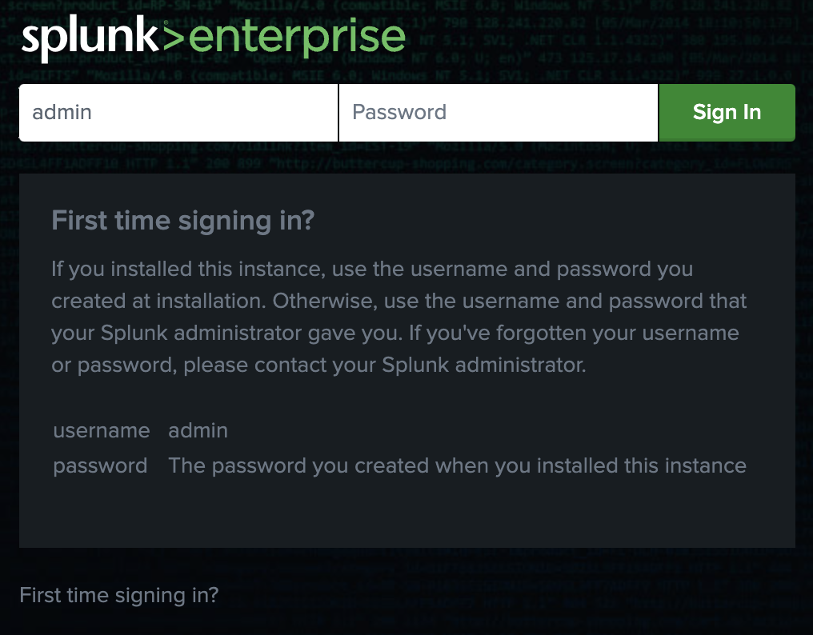
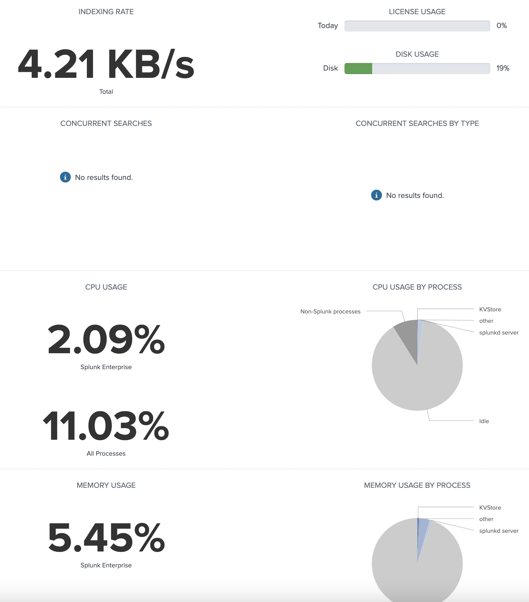
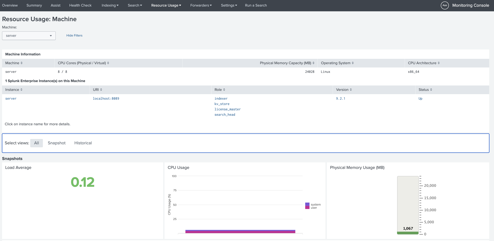
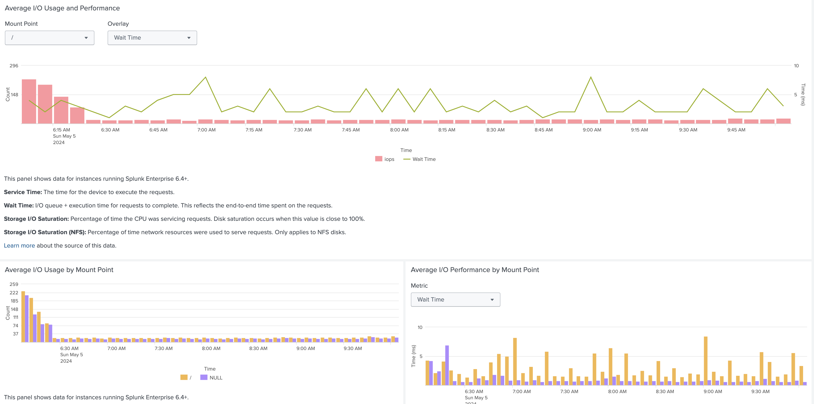
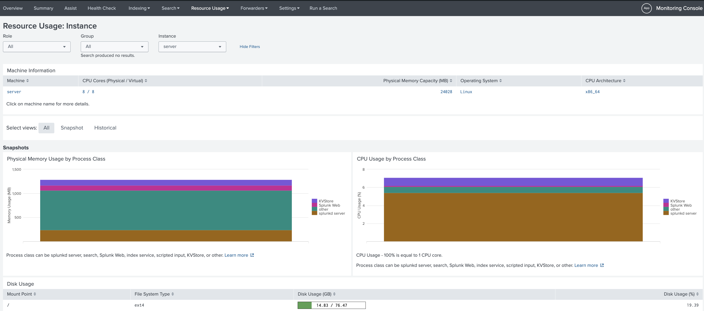
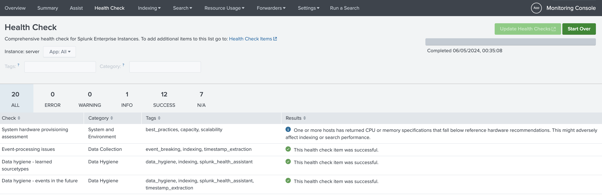

# Initial Setup

## Note: For loging to the Ubuntu server:

```bash
ssh -oHostKeyAlgorithms=+ssh-rsa user@ubuntu_server_ip
```

1. Download splunk install image and MD5sum file (you will need a splunk.com user for it)
```bash
wget -O splunk-9.2.1-78803f08aabb-linux-2.6-amd64.deb "https://download.splunk.com/products/splunk/releases/9.2.1/linux/splunk-9.2.1-78803f08aabb-linux-2.6-amd64.deb"
```

2. Check MD5 hash
```bash
$ echo "6cf3e47174f54f826b15ebc1ab8616b7 splunk-9.2.1-78803f08aabb-linux-2.6-amd64.deb" | md5sum -c
splunk-9.2.1-78803f08aabb-linux-2.6-amd64.deb: OK
```

3. Install Splunk
```bash
dpkg -i splunk-9.2.1-78803f08aabb-linux-2.6-amd64.deb
```

4. check the installation
```bash
$ dpkg --status splunk
Package: splunk
Status: install ok installed
Maintainer: Splunk Inc. <info@splunk.com>
Architecture: amd64
Version: 9.2.1+78803f08aabb
Description: Splunk The platform for machine data.
```

5. Create a user-seed file with credentials
```bash
$ vim /opt/splunk/etc/system/local/user-seed.conf

[user_info]
USERNAME = admin
PASSWORD = $uperS3cr3t!!
```

6. Enable auto-boot of Splunk and accept the license
```bash
$ /opt/splunk/bin/splunk enable boot-start --accept-license
Init script installed at /etc/init.d/splunk.
Init script is configured to run at boot.
```

7. Start Splunk
```bash
/opt/splunk/bin/splunk start
```

8. Check the splunkd.log [optional]
```bash
less /opt/splunk/var/log/splunk/splunkd.log
```

9. Log in to the web console: (no TLS this time)
http://<IP_ADDRESS:8000>



10. web.conf file is read-only, copy it, change the permisson of it and edit it.
```bash
$ cp /opt/splunk/etc/system/default/web.conf /opt/splunk/etc/system/local/web.conf

change the permission
$ chmod 600 /opt/splunk/etc/system/local/web.conf

Change the http port and Splunk WebSSL values to:
$ vim /opt/splunk/etc/system/local/web.conf

httpport = 443
enableSplunkWebSSL =  true 

```

11. Restart splunk
```bash
/opt/splunk/bin/splunk restart
```

12. Login again to the web console via HTTPs, port number 443:
https://<IP_ADDRESS:443>

13. Go to Settings --> Monitor Console. You can see a general information about the system, indexing rate, disk and license usage. Optionaly you can turn on Splunk Assist.


14. Go to Resource usage --> Resource Usage: Machine. You can see OS version, architecture, physical memory, all the splunk instances (currently only one instance). 


15. The disk IO metric is one of the most important in loging system. 


16. Open Resource Usage: Instance. This showes the CPU and memory usage too, but for the Splunk services itself. It comes handy when you sizing a cluster, it's a valuable information to know what resources are being used on search versus an index.



17. Open the Health Check tab and run the health check. (should not take long). It checks the system against the best practices and recommendations.


