### Data Inputs (~10m)

1. Let's search some data and visualize it. Go to Settings --> Data --> Data Inputs. There is a Local input and Forwarded inputs, which is a data from other sources. Click on "Files & Directories"
---
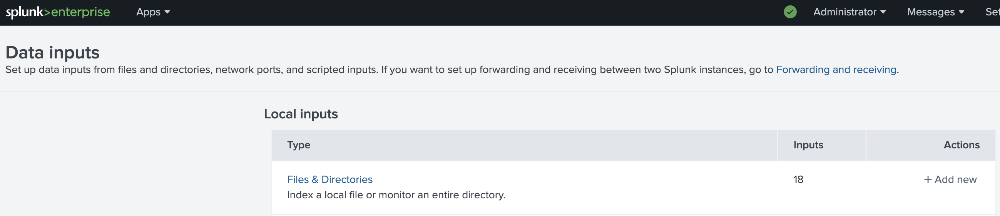

2. These are Splunk logs. Let's add the /var/log/auth. Click on "New Local Files & Directories" at the right upper corner.
---
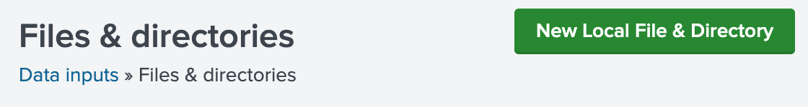

3. Click "New Local Files & directory" and browse /var/log/auth file. Click next.
---
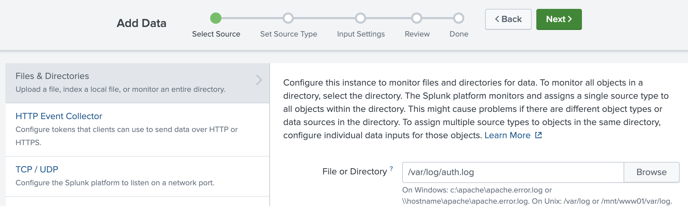

4. Change Source type: linux_secure and hit next.
---

5. Create a new index and name it, e.g., linux_secure_index
---
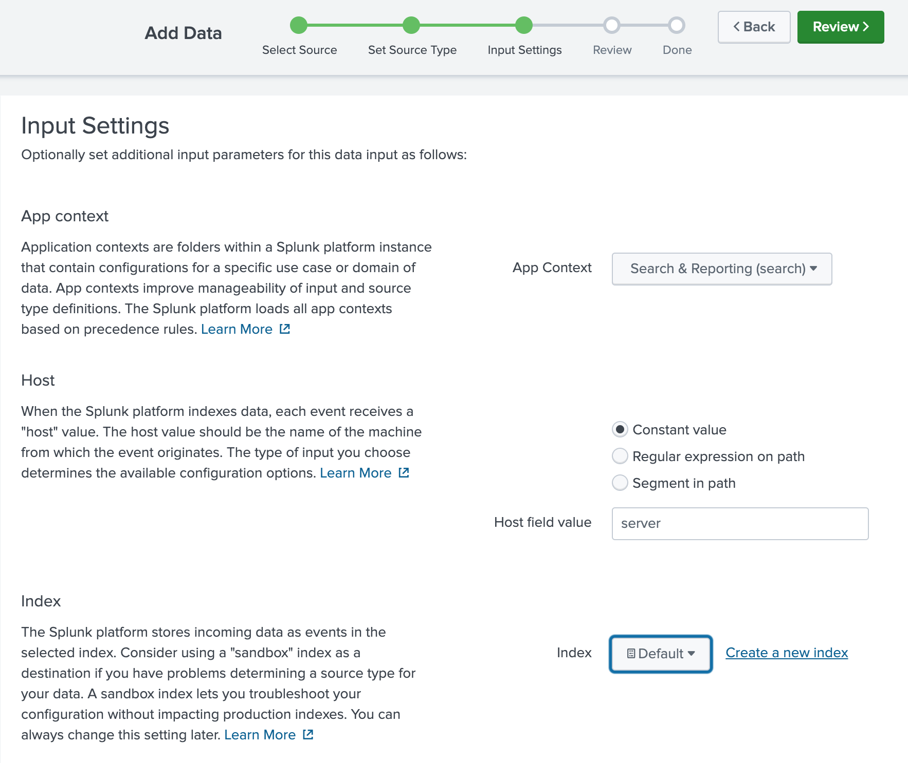

6. Simply name the index (or you can leave it on the default as well. Go through the settings and options.
---
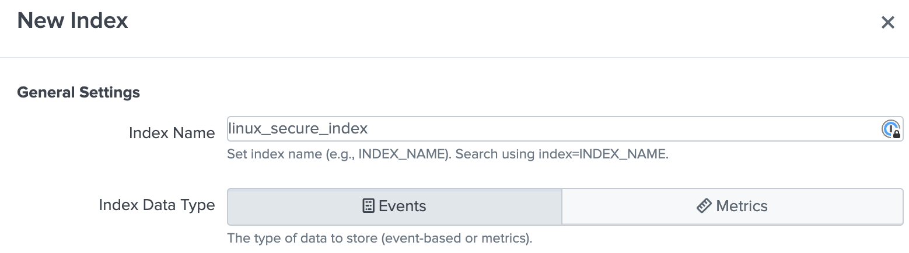

7. Hit the Review button and Submit it. Input is file, the source is /var/log/auth.log, host is our host (server) and the index is the one You specified in the previous step.
---
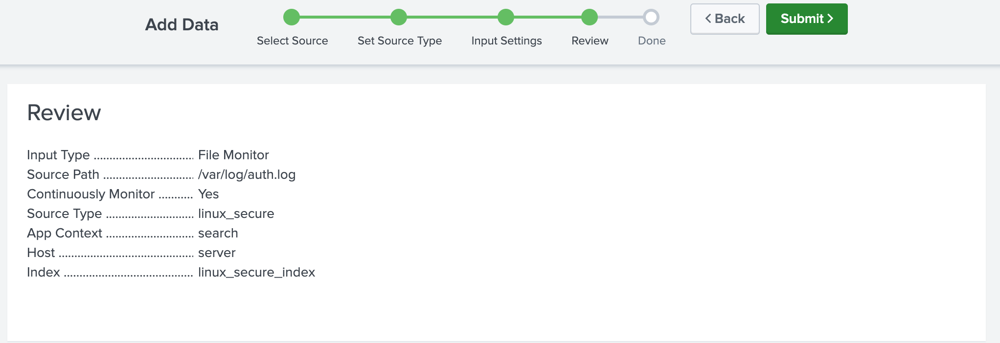

8. You just created your first index. Well, done! :) Let's search for some data.
---
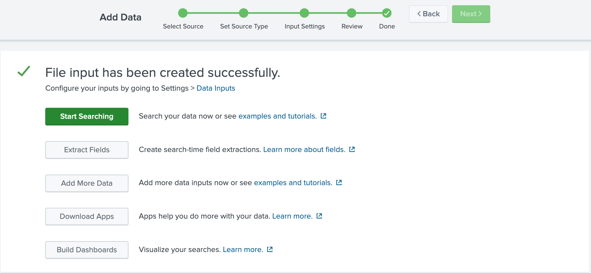

9. Go back to "Settings --> Data --> Data inputs --> Files and directories", you should see at the bottom the newly created monitored file.

10. Go to Apps --> Search & Reporting. Type in the search filed index="linux_secure_index" (or the name of the index you specified at step 5). The default time window is 24h. Go through the result, expand the fields.
---
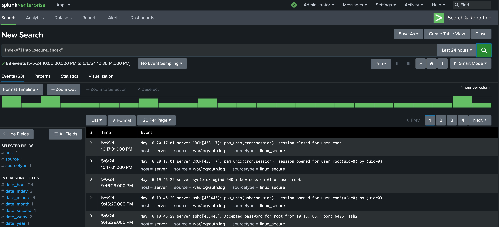

11. In the Settings --> User and authentication --> Users --> edit Admin and set the "Time Zone" to GMT +1
---
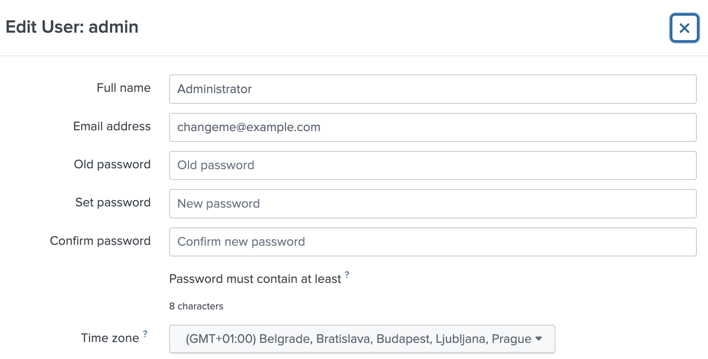

12. Generate some authentication failure log messages connecting to Splunk server via SSH and mistype the password.
---
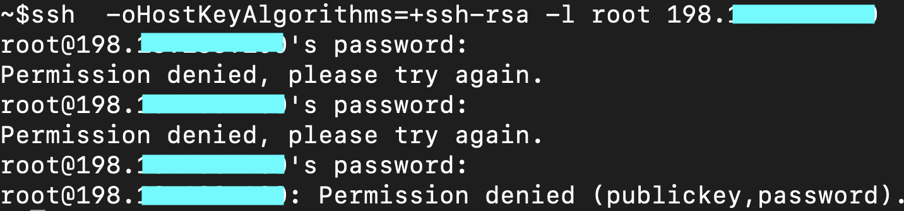

13. Search for index="linux_secure_index" , change the time window to 30min. You should see the login failure messages generated by the linux system
---
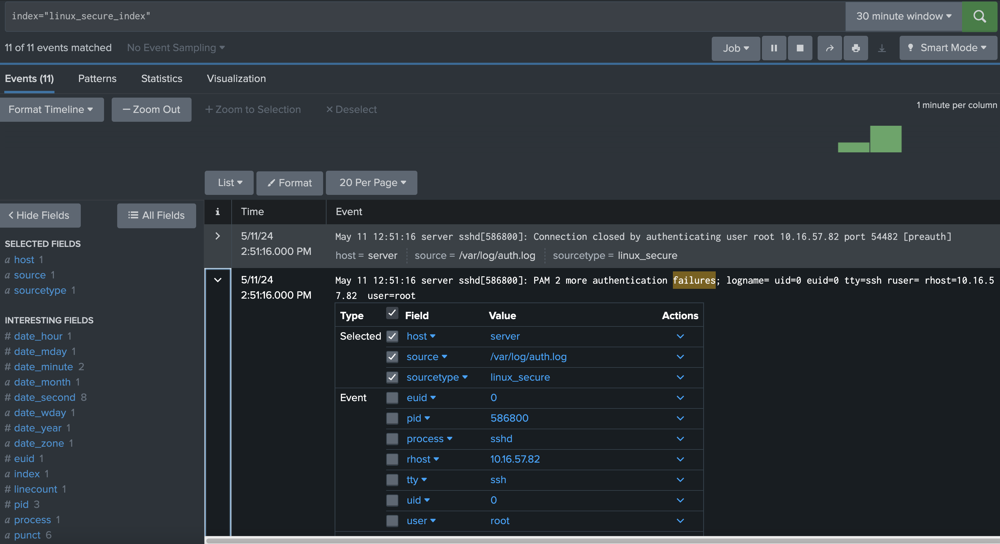

14. Click on the word "failures" and add to search. (it takes few seconds to see the result.)
---
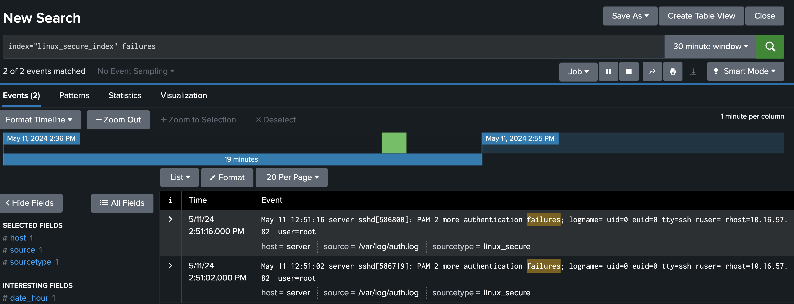

15. Click through at the left side of the screen, look for "rhost, process and pid" paramteres. It's easy as we have barrely any logs, but in production there will be thousands of lines.
---

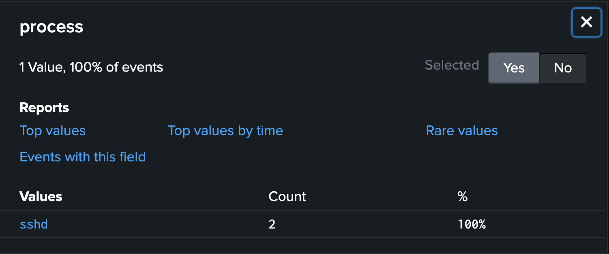
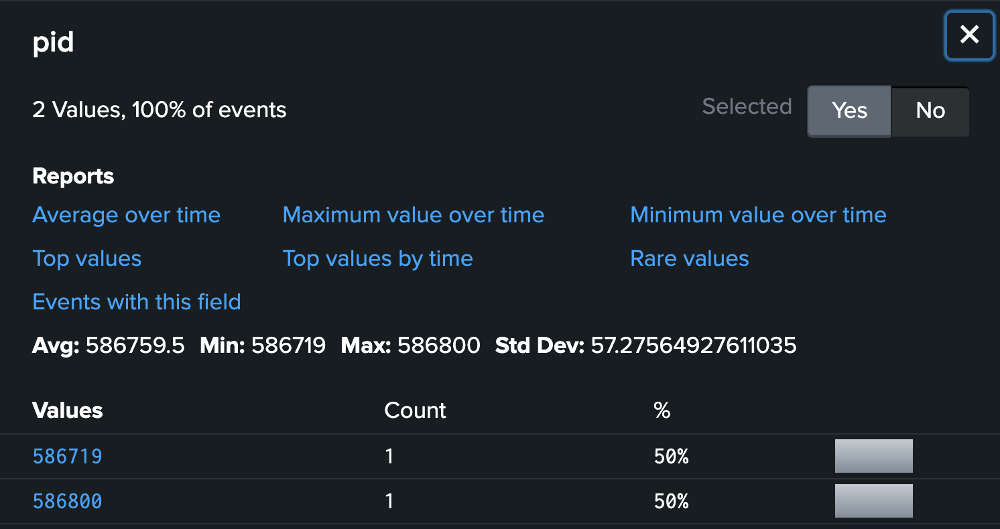

