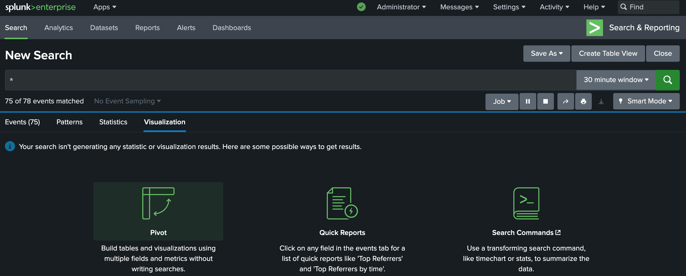
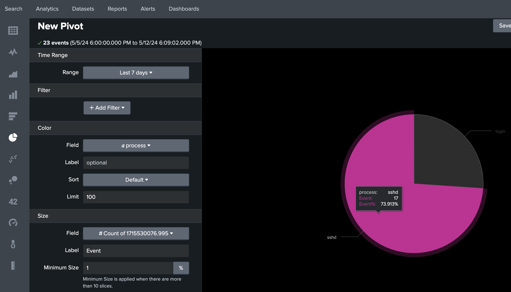
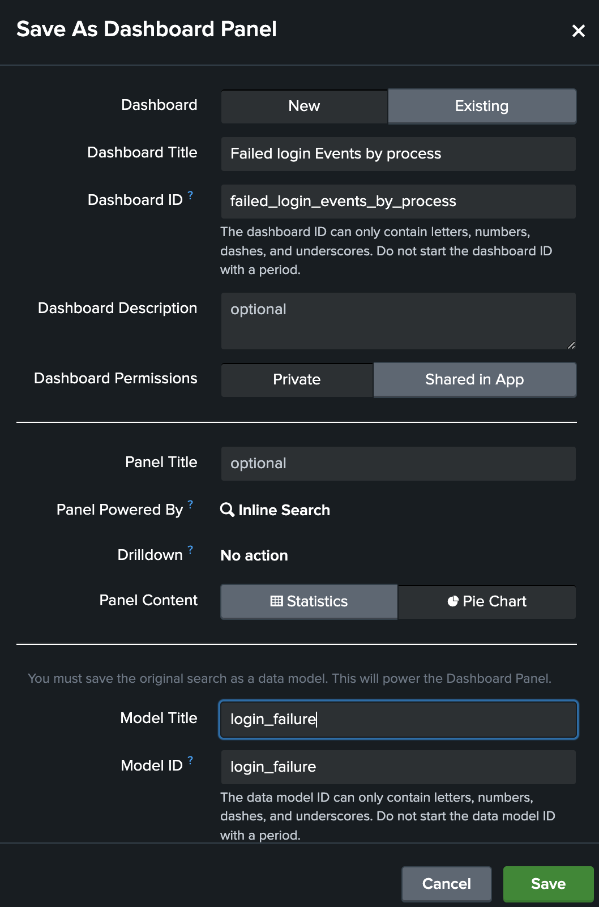
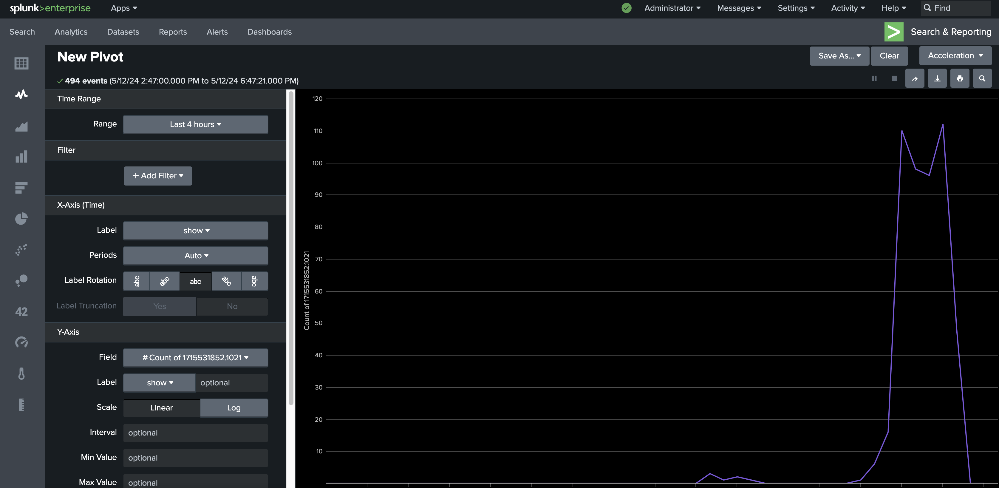
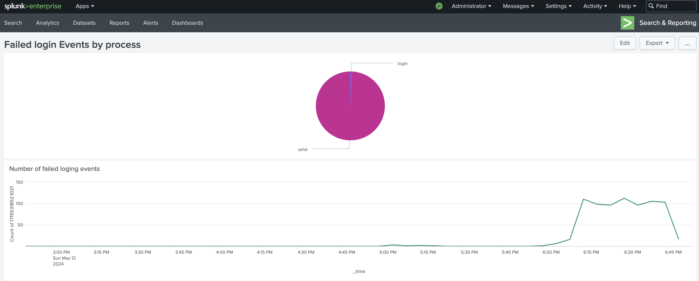

1. Let's visualise the login failures. Go to Search --> type index= "linux_secure_index". Click on the sub-tab "Visualization" --> Pivot (all fields)
----


2. Pick the pie chard option from the left menu. Add color = rhost. you can hover over your mose to see the different data represented in pie chart format.
---


3. Change the Label field at the "Size" section to someting reasonable, e.g., "Events" to see a nicer word in the pie chart.
---


4. Save it as Dashboard pannel (right upper corner)
---


5. Add this time a Line chart to our dashboard.
- Search for index= linux_secure_index
- click on visualization
- Select Line Chart and at Y-Axis section change to Label:Events
---


6. Save it and add to the existing Dashboard (Failed login Events). name a title to something meaningful, like: Number of failed login events:
---


7. Optional: Generate failed login entries with Hydra. 
- login to Windows-10-80G machine via VM console.
- Download Hydra Windows: https://github.com/maaaaz/thc-hydra-windows/archive/master.zip
- Download the most common 10k passwords from: https://github.com/danielmiessler/SecLists/blob/master/Passwords/Common-Credentials/10k-most-common.txt
- run Hydra from the cmd, to generata logs:
```ps
hydra.exe -l root -P 10k-most-common.txt ssh://linux_server_IP:22
```

