### Integrate Firewall Management with Splunk via eStreamer (30m)

1. Logint to FMC via web-console (it's a CLI access via web interface), check the IP address and set the default GW to 198.18.128.1
```bash
expert
sudo /usr/local/sf/bin/configure-network
```

2. Login to FTD (via VM console )and configure the management IP to: 198.18.133.200/18, GW: 198.18.128.1
if the auto-setup doesn't start:
```bash
$ configure network ipv4 manual 198.18.133.200 255.255.240.0 198.18.128.1

Manage the device locally? (yes/no) NO
Configure firewall mode? (routed/transparent) [routed]
```

3. Check the reachability to FMC and register it:
```bash
ping system 198.18.133.102
configure manager add 198.18.133.102 your_secret_key
```

4. Login to FMC (https://198.18.133.102) and start 90day eval.
---
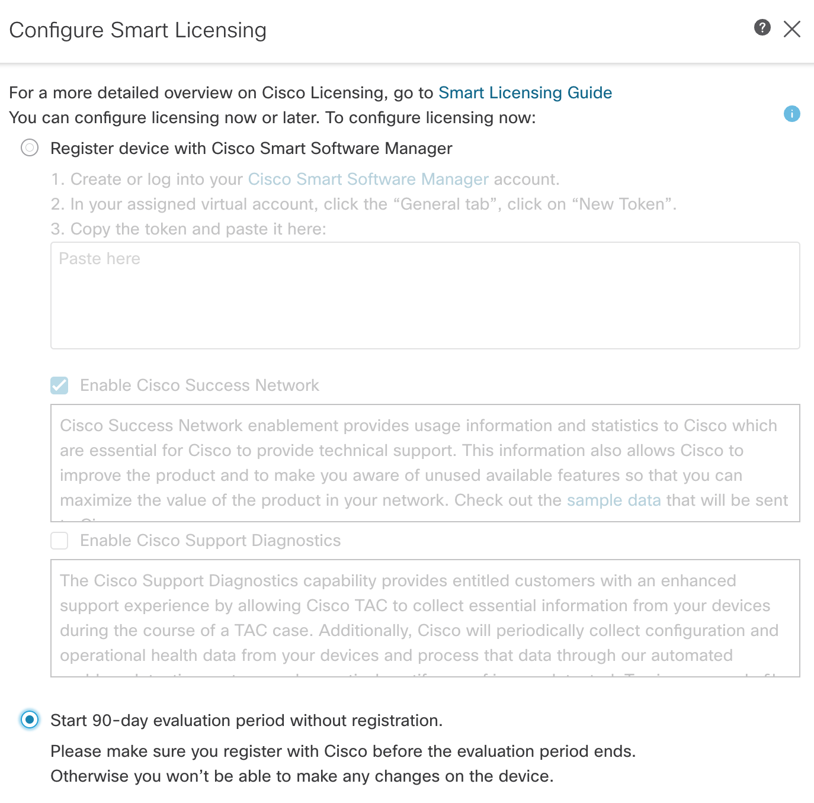

5. Go to Devices --> Device Management --> Add Device (righ upper corner of the screen) --> and register a vNGFW (it might take a few minutes)
---
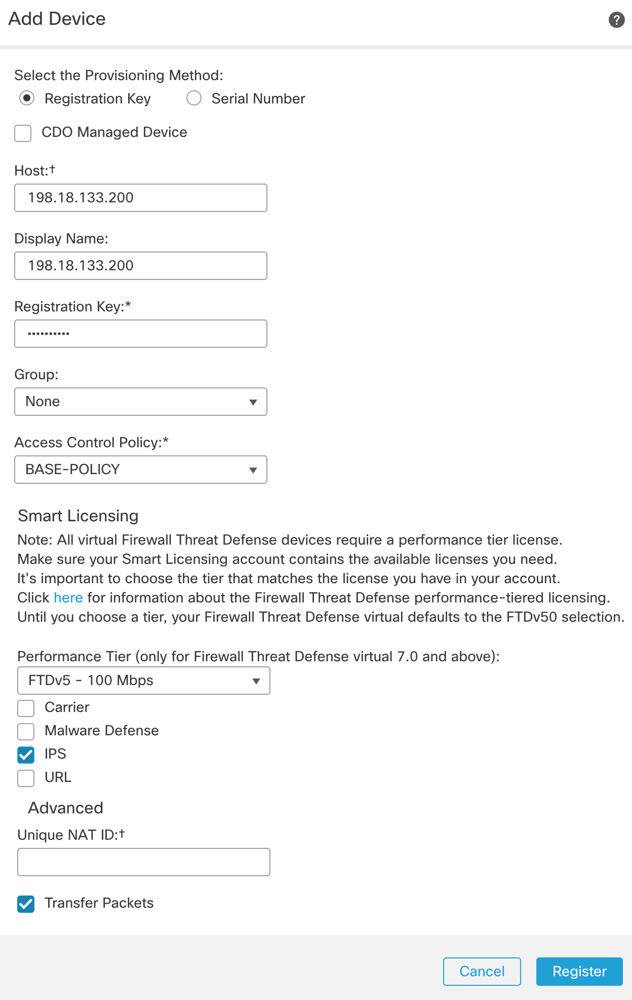
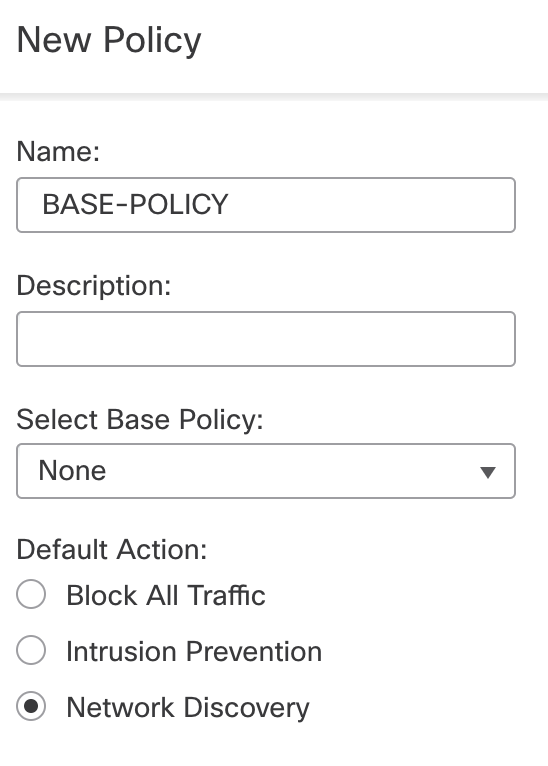

Note: base_policy doesn't exits, you need to create it

6. For FMC and Splunk integration 2 APPs are needed.
- Firepower event data must be in Splunk. To bring data into Splunk, use Cisco Secure eStreamer client Add-on for Splunk:  https://splunkbase.splunk.com/app/3662/ (Splunk.com registration is needed)
- Cisco Secure Firewall APP for Splunk is availabel from Splunkbase: https://splunkbase.splunk.com/app/4388/. The app provides a number of dashboards and other useful functions.
---
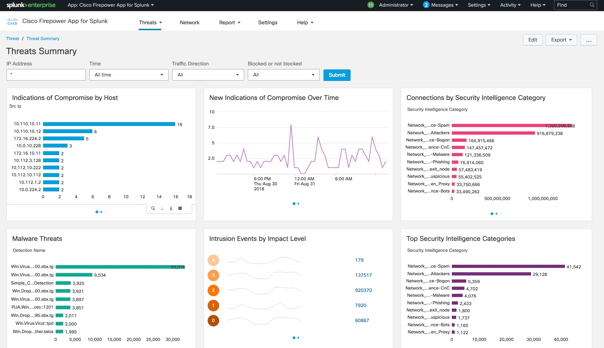

7. Let's install first the Cisco Secure eStreamer APP. Logint to Splunk and go to Apps --> Find More Apps --> Browse for: Cisco Secure eStreamer. (if you get a "No route to host error message, add 208.67.222.222 dns server to resolv.conf --> nano /etc/resolv.conf and add a line nameserver 208.67.222.222)
---
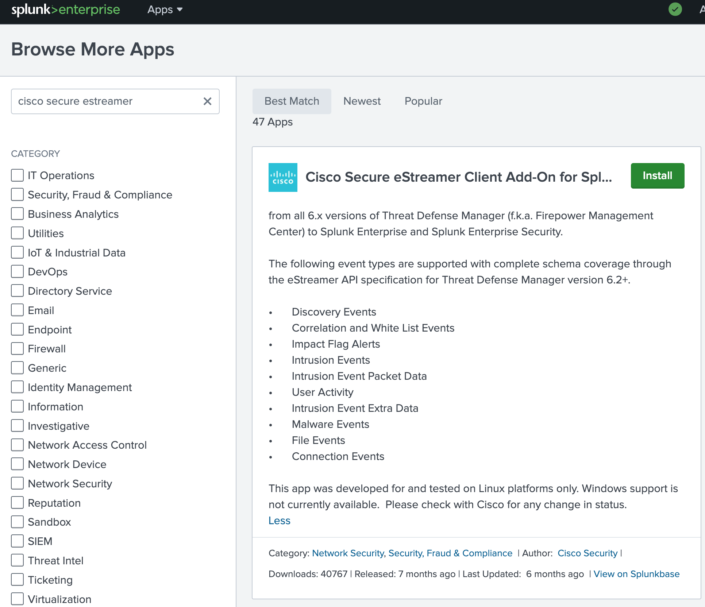

8. SSH to the linux server and check the eStreamer.conf file. The "outputters" section tells where to store the data from FMC. Don't change it, it's good as it is. Note: in the production environment the workerProcesses can be incresed.
```bash
$ cd /opt/splunk/etc/apps/TA-eStreamer/bin/encore
$ nano estreamer.conf

"outputters": [
            {
                "adapter": "splunk",
                "enabled": true,
                "stream": {
                    "options": {
                        "maxLogs": 10000,
                        "rotate": true
                    },
                    "uri": "relfile:///data/splunk/encore.{0}.log"
                }
            }

```

9. The "servers" section is where we specify the FMC's IP address. The certificate file name needs to be exactly "client.pkcs12". We will generate that cert in the next step at the FMC GUI.

```bash
"servers": [
            {
                "host": "198.18.133.102",
                "pkcs12Filepath": "client.pkcs12",
                "port": 8302,
                "tls@comment": "Valid values are 1.0 and 1.2",
                "tlsVersion": 1.2
            }
        ]

```

10. In the FMC GUI, go to: Integration --> Other Integrations --> eStreamer and create a Client (This is an IP address of the Splunk instance). Remember the password as you will need it in the upcomming steps.
---
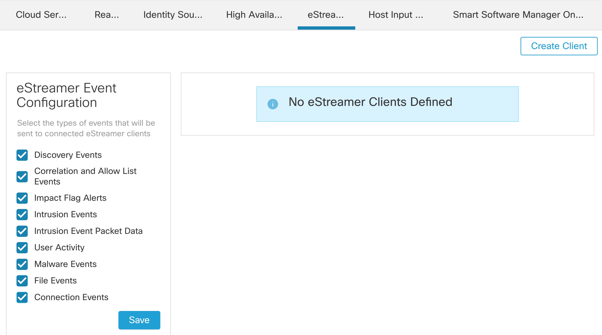

11. Download the certificate and name it client.pkcs12.
---


12. Copy the cert to Splunk server e.g. with SCP.
```bash
scp -oHostKeyAlgorithms=+ssh-rsa client.pkcs12 user@198.18.133.100:/home/user/
```
```bash
cp client.pkcs12 /opt/splunk/etc/apps/TA-eStreamer/bin/encore
```

14. Run these commands: 
```bash
export SPLUNK_HOME=/opt/splunk
export LD_LIBRARY_PATH=$SPLUNK_HOME/lib
```
note: You can add those two lines to the .bash_profile -> source ~/.bash_profile


15. extract the cert
```bash
openssl pkcs12 -in "client.pkcs12" -nocerts -nodes -out "/opt/splunk/etc/apps/TA-eStreamer/bin/encore/198.18.133.102-8302_pkcs.key" -legacy
openssl pkcs12 -in "client.pkcs12" -clcerts -nokeys -out "/opt/splunk/etc/apps/TA-eStreamer/bin/encore/198.18.133.102-8302_pkcs.cert" -legacy
```

16. Run the "splencore.sh" script to see the connection between FMC and Splunk App
```bash
/opt/splunk/etc/apps/TA-eStreamer/bin/splencore.sh test
```

17. Start eStreamer
```bash
/opt/splunk/etc/apps/TA-eStreamer/bin/splencore.sh start
```

18. and check if it is running properly:
```bash
$ ps aux | grep estreamer
root      275877  4.4  0.0 247600 21704 pts/2    Sl   17:11   0:01 /opt/splunk/bin/python3 ./estreamer/service.py estreamer.conf
root      275883  0.0  0.0 174500 19320 pts/2    Sl   17:11   0:00 /opt/splunk/bin/python3 ./estreamer/service.py estreamer.conf
root      276028  0.0  0.0   7008  2088 pts/2    S+   17:11   0:00 grep --color=auto estreamer
```
```bash
netstat -an | egrep "8302|Recv-Q"

Proto Recv-Q Send-Q Local Address           Foreign Address         State      
tcp        0      0 198.18.133.100:39662    198.18.133.102:8302     ESTABLISHED
```

19. Install the Cisco Secure Firewall APP for Splunk. More info --> https://splunkbase.splunk.com/app/4388/
- Go to APPs --> Find more APPs and search for it.
- install it and restart Spunk

tech details: https://www.cisco.com/c/en/us/td/docs/security/firepower/splunk/Cisco_Firepower_App_for_Splunk_User_Guide.html

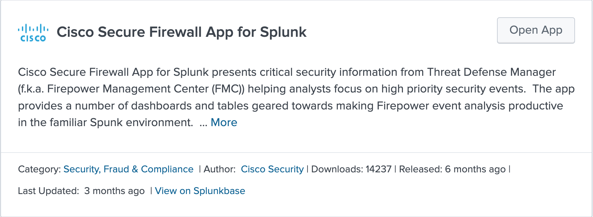

20. Configure firepower's OUTSIDE and INSIDE interfaces. Login to FMC and go to Devices --> Device Management --> click on FTD with IP:198.18.133.200
- Click GigabitEthernet0/0 and assigne:
    - Name: OUTSIDE
    - Enable: ON
    - IP address 198.18.1.2/24
    - Security Zone: OUTSIDE-ZONE
- Click GigabitEthernet0/1 and configure:
    - Name: INSIDE
    - Enable: ON
    - IP address 198.18.2.2/24.
    - Security Zone: INSIDE-ZONE
- click gigabitEternet0/2 and:
    - Name: ATTACKER
    - Enable: ON
    - IP address: 198.18.24.2/24
    - Security Zone: ATTACKER-ZONE    
Click OK and Save.
---
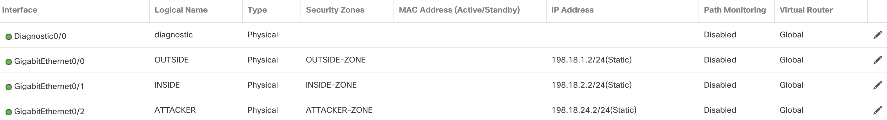

21. Configure the default route for the FTD via OUTSIDE interface. Click on "Routing" tab --> Static Router --> Add Route and save it. Gateway IP address is: 198.18.1.1
---
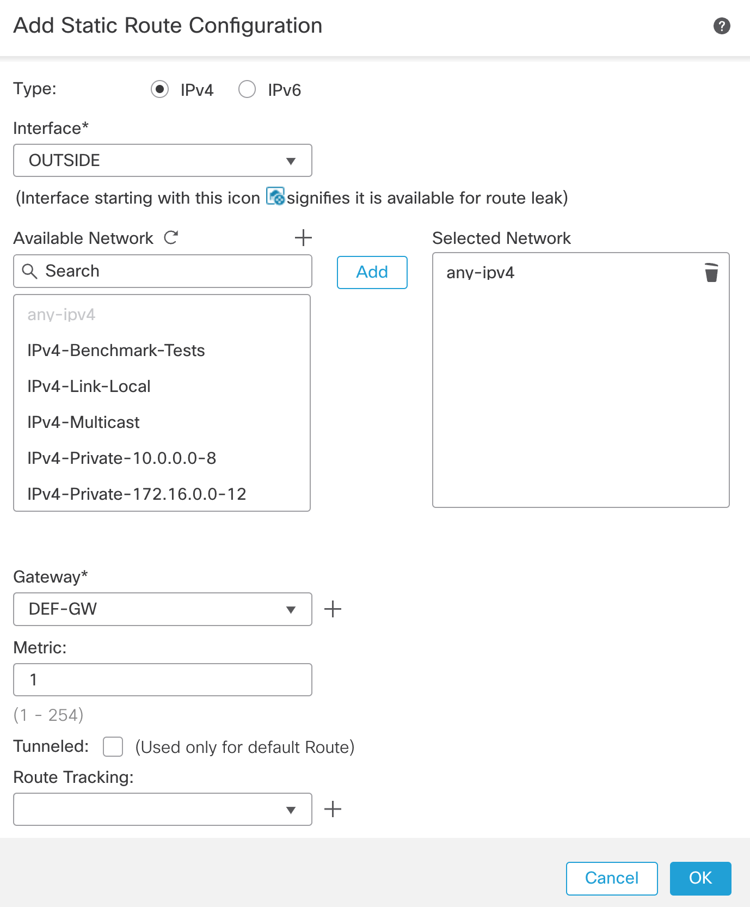

22. Deploy the configuration if you haven't done it so far. Configure NAT, so clients on INSIDE network should have internet access via FTD. Go to Device --> NAT --> Threat Defense NAT Policy and:
- Name it
- pick the Firepower device (198.18.133.200) and add to Policy --> Save it.
- Add NAT rule (top right corner)
---
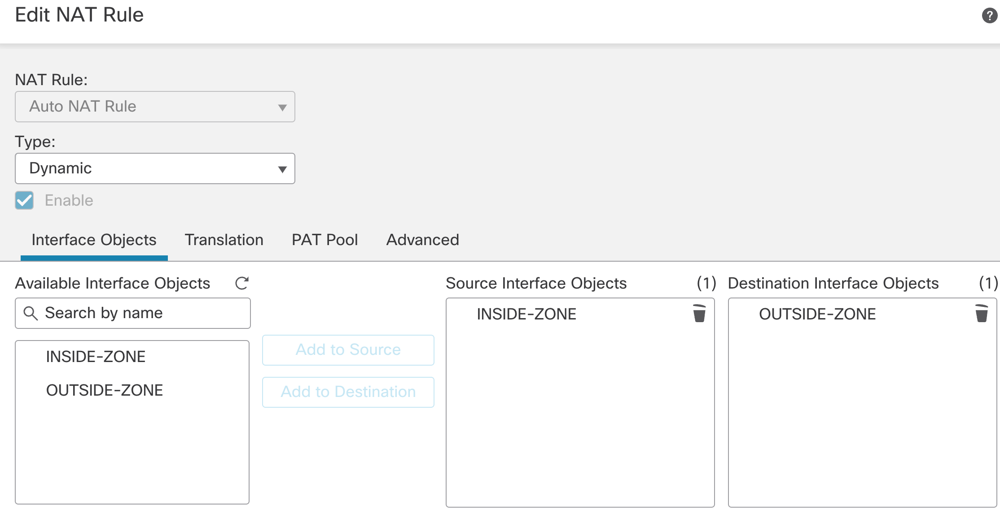

note: Create an **INSIDE-LAN** network object: 198.18.2.0/24
---
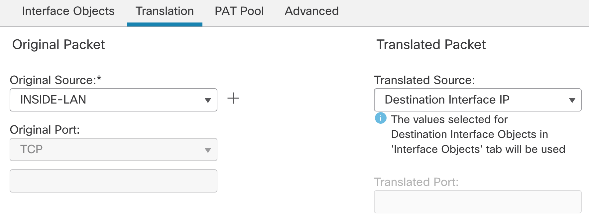

23. Create a rule in the Access-Policy with logging enabled. You might already have an Access-Policy (Base Policy) assigned to the FTD.
---
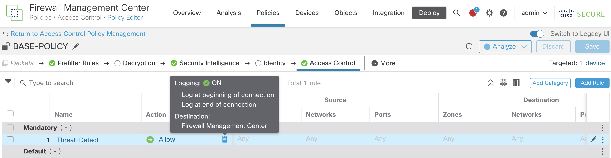

24. Deploy the config
---
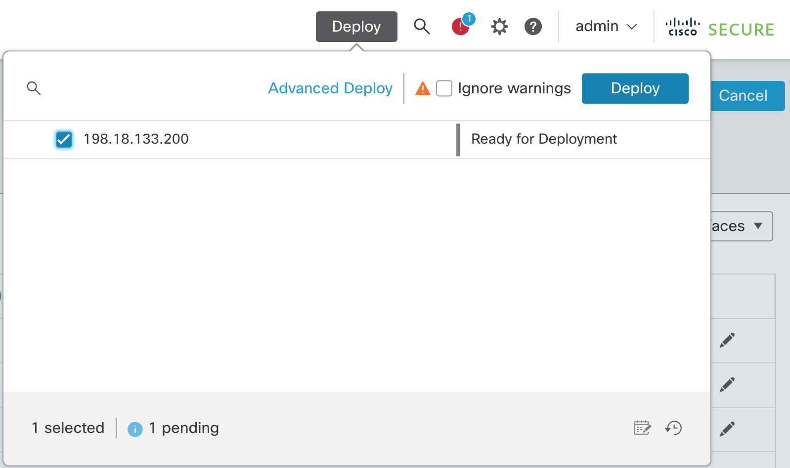

25. Log in to win10 PC via VM Console (or RD), assig the IP address and default gateway (FTD's INSIDE interface).
Note: use public DNS resolver: 208.67.222.222
---
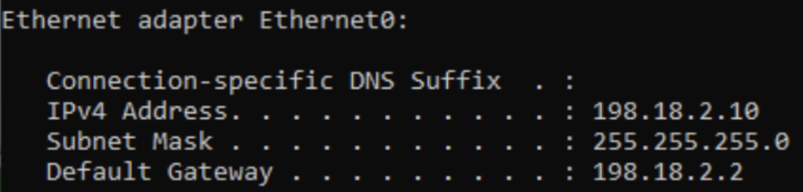

26. Check internet access from the PC by performing tasks such as pinging, testing DNS resolution, and accessing websites. If everything is functioning correctly, you should see the corresponding logs:
- in the FMC's Unified View 
- in Splunk search and in Splunk APP for Firepower as well
---
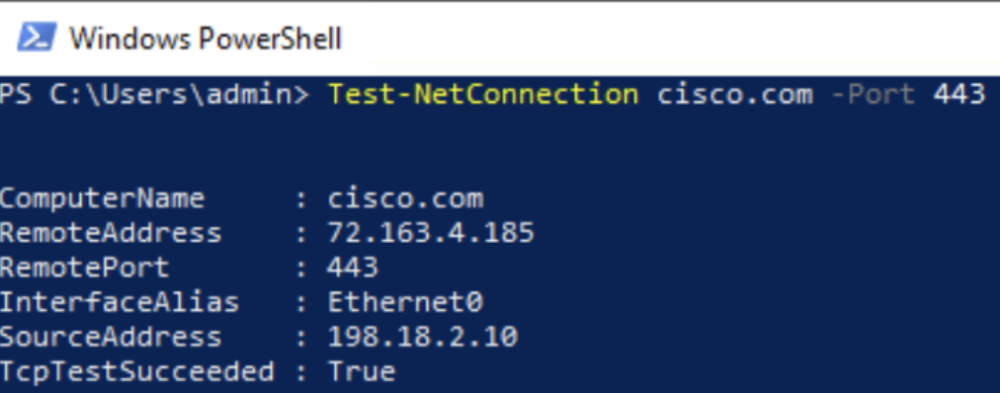
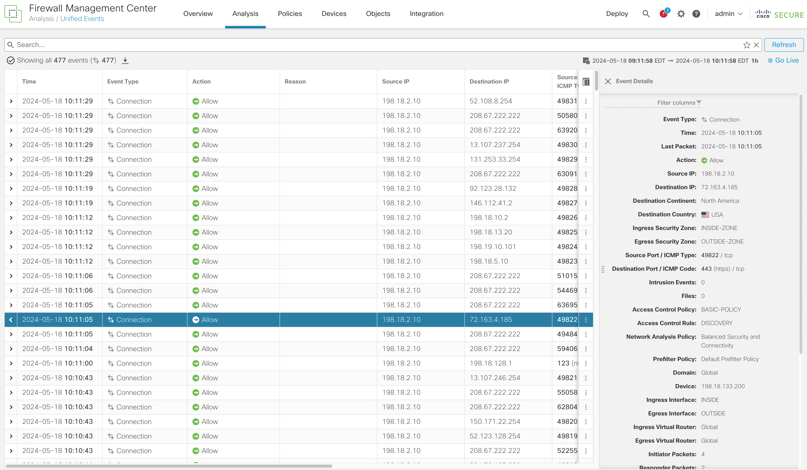
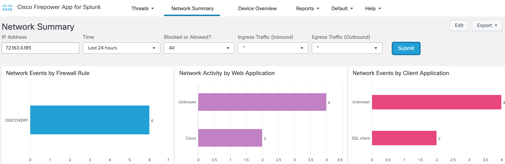


