## OPTIONAL: FILE Policy, IPS Policy and SSL/TLS decrypt policy

1. Log in to FMC and go to: Policies --> Malware and Files --> New File Policy --> give a name like: LAB-FILE-POLICY --> Add rule to the Policy with the setup below, save it.
---
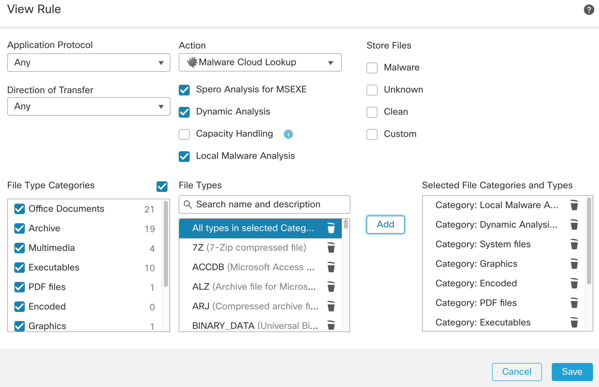

- Note: you need to have Malware license assigned to the firewall. Devices --> Device Management --> click on the IP of the managed device --> Device tab --> edit the License box with the pencil icon and turn on IPS, Malware Defense and URL.
---
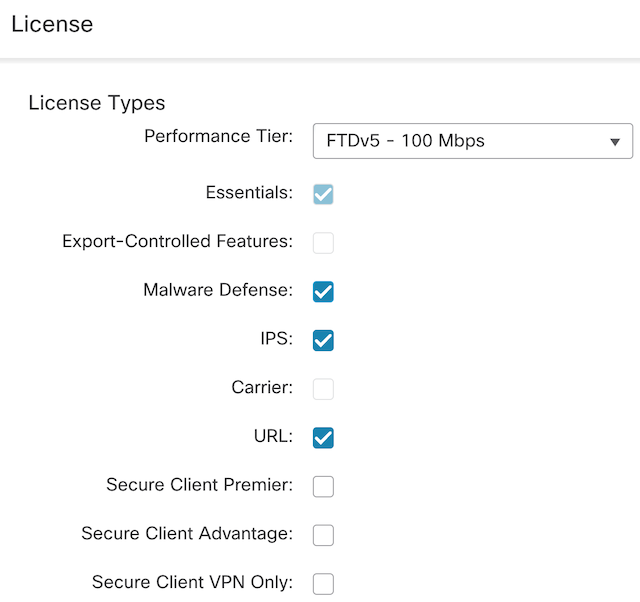

2.  Go to Policies --> Network Discovery
    - Delete the rule for network 0.0.0.0/0 and ::/0
    - Add a new rule, covering the internal IPs and the public IPs you need to protect. (my public IPs)
    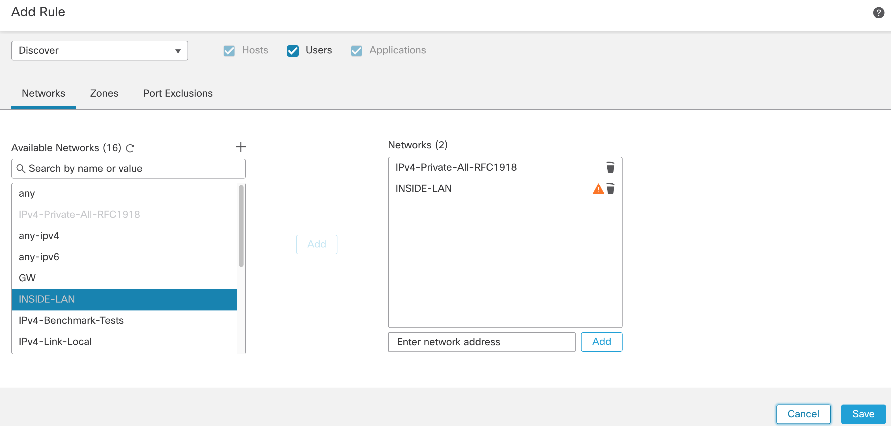

3. Deploy the configuration before you go to the next step!

4. Go to Policies --> Intrusion --> Create Policy --> give it a name, like: LAB-IPS-POLICY and Save it.
---
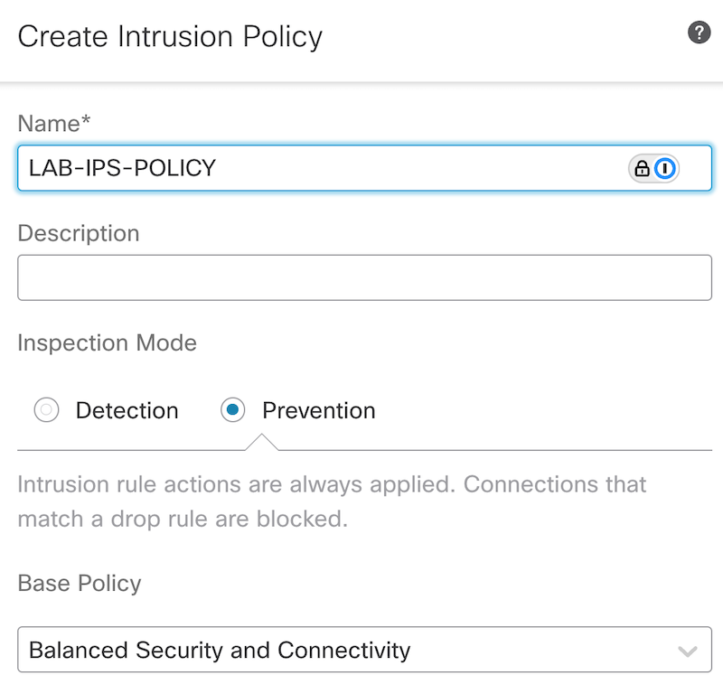

- Click on Snort 3 Version to edit the IPS policy (Right-upper corner)
- Click on Recommendation (Not in Use - yet!) and hit Start.
---
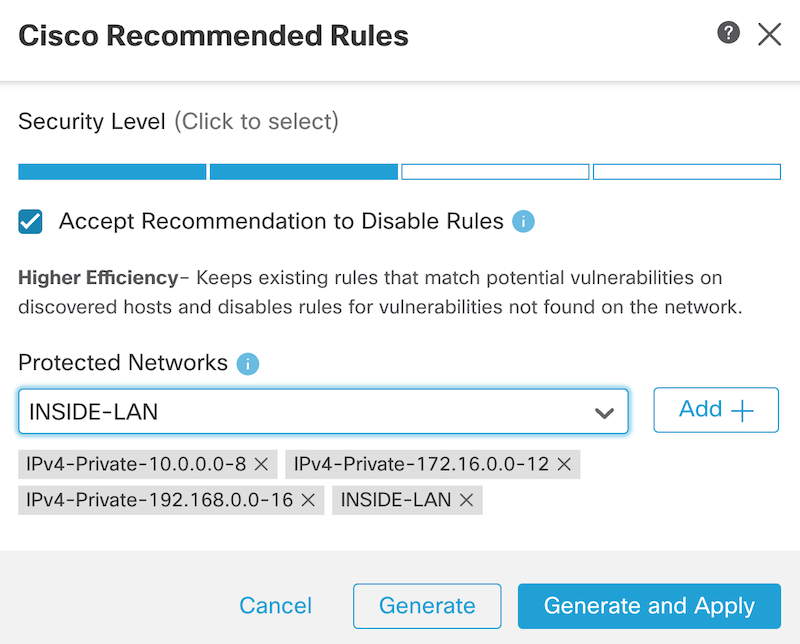
- Choose "Generate and Apply"

## Let's see the Firewall's live log and the applied IPS, file policies. 

5. Log in to Win10 PC via VM console and querry a URL from PS:

```ps
curl https://cisco.com
```
- Note: you can use -k switch to bypass certificate validation 
- You can spoof the user-agent. Threat hunters sometimes look for odd user agents. Sure, it can be spoofed easily, but if an endpoint sometimes claims it's a Win10 machine then it changes its mind and says i'm a win7. hm, worth to inspect it. 
```cmd
curl -A "Mozilla/5.0 (Windows NT 10.0; Win64; x64)" http://example.com
```

6. You should see the connection in the FMC's Unified Event. Analysis --> Unified Event --> Go Live (right corner)
---
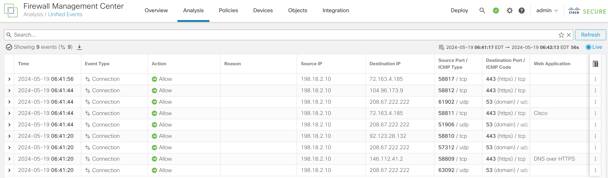

7. and in the Splunk Firewall app as well (Go to: Firepower App for Splunk --> Reports --> Event Viewer)
---
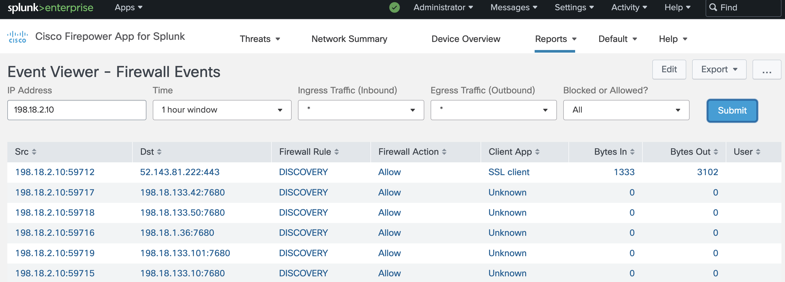

8. Creat a custom Snort3 IPS rule to trigger on string "hello World!"
- Note: FMC does not have Snort3 rule editor. You can creat a Snort2 and convert it OR create a Snort3 custom rule in a text file and upload it via FMC. 

9. Add the following line to text file. The extension of the file should be .txt
```bash
alert tcp any any -> any any (msg:"Detected Hello World! string"; content:"Hello World!"; sid:1000004;)
```
10. Upload the customer Snort3 rule to FMC. Go to: Objects --> Intrusion Rules --> Snort 3 All Rules --> Task (righ corner) --> Upload Snort 3 rules. 
---
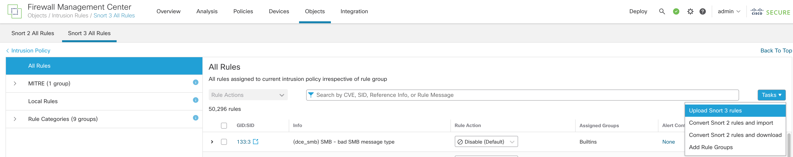
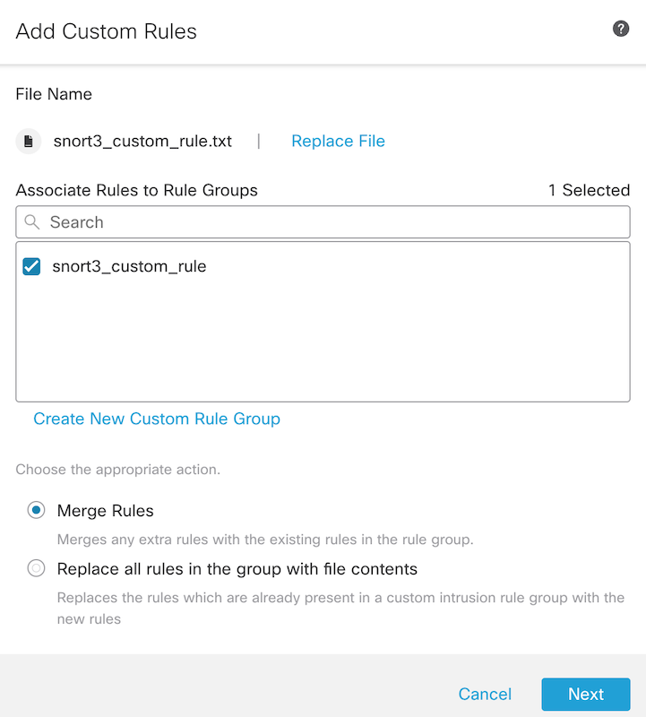
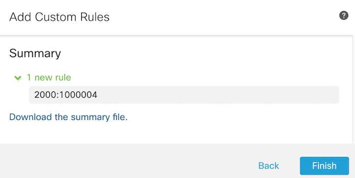

11. CLick on the left side of the window to "Local Rules --> snort3_custom_rule" and enable the rule you just created.
---
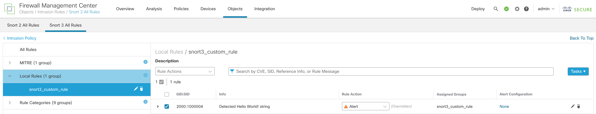

- Note: Do not forget to assign the created IPS policy (LAB-IPS-POLICY) to the rule in the Access Control policy
---
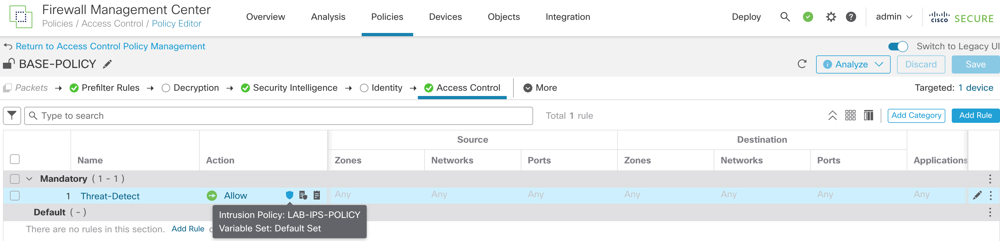

12. <mark>Deploy the changes!</mark>

13. Login to linux server and start a netcat listener on port 2222
```bash
nc -l 2222
```

14. Login to win10 and download a netcat program to the Temp folder from:
https://github.com/int0x33/nc.exe/blob/master/nc64.exe

15. Start netcat and send a "hello World!" string
```cmd
c:\temp\nc64.exe 198.18.133.100 2222
Hello World!
```

16. You should see the the win10 input strings at the at outher end of the nc tunnel, on the Linux machine:
```bash
user@server:~# nc -l 2222
Hello World!
```
17. Go to the FMC's Unified Event page (Analysis --> Unified Events) and look for an IPS event. Is has a small, orang alien icon. 
- Note: you can filter out the regular connection events by selecting the connections at the "Action" column and choose "Add exclusion to filter"
---
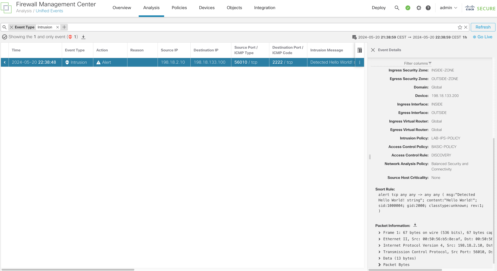

18. The same simple IPS rule should be visible in the Splunk Firepower App.
---
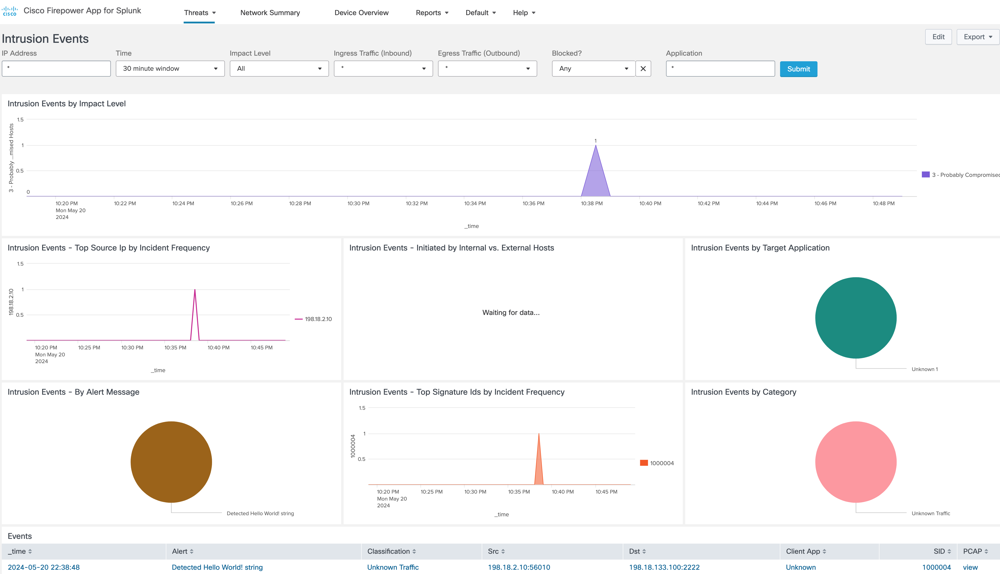

19. The snort rule we created will trigger on exact match. Obviously, you can use regular expression to have more "loose" rules. An example would be:
```snort
alert tcp any any -> any any (msg:"Loose match for Hello World! string"; pcre:"/hello\s*world\s*!/i"; sid:1000005;)
```

Snort3 rule explanation:
- alert --> the action to take when the rule matched. Generate an alert
- tcp --> the protocol to match (TCP in this case)
- any any --> match traffic from any source IP to any destination IP and port
- msg --> the message to include in the alert
- pcre --> the PCRE pattern to match:
    - `hello` --> match the world "hello"
    - \s* --> matches zero or more whitespace characters
    - ! --> matches an exclamation mark
    - /i --> makes the match case-insensitive
    - sid:xx -> snort rule ID, should be unique for each rule

20. Bonus: You can upgrade FMC and the firewall to version 7.4.x to see how Encrypted Visibility Engine detects the traffic. More about EVE: https://secure.cisco.com/secure-firewall/docs/encrypted-visibility-engine