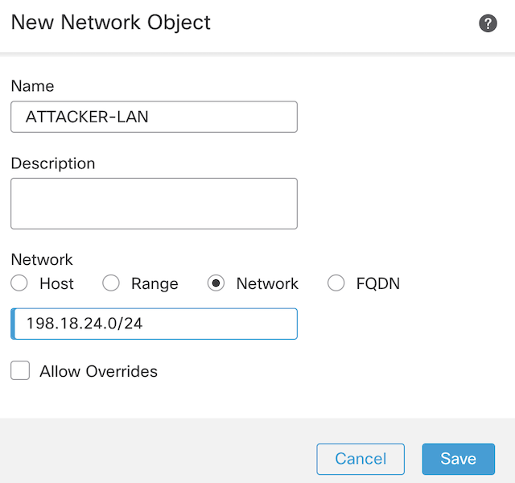

### Pre-conf the Kali linux for offensive attack testing (10m)

1. Loging to Kali linux via VM Console and assigne
- IP address: 198.18.24.100/24
- Subnet: 255.255.255.0
- Gateway: 198.18.24.1

Note: gateway's last IP octet is .2

```bash
nano /etc/network/interfaces
```

```bash
address 198.18.24.100
netmask 255.255.255.0
broadcast 198.18.24.255
gateway 198.18.24.2
```

```bash
sudo ifdonw eth0
sudo ifup eth0
ip add
```
2. Set the DNS server to: 208.67.222.222
```bash
$ sudo nano /etc/resolv.conf

nameserver 208.67.222.222
```

3. Configure the Firewall NAT policy so the Kali box has access to the internet. 
- Go to Devices --> NAT 
- Edit the existing NAT rule created in the previous step
- Add a new "Auto NAT Rule" with the following paramteres:
---

- Create a network object with: 198.18.24.0/24
---

- Move to the "Translation tab"
---


Note: Configure a port forward so the Kali box can be access via SSH. 
---


4. Save the configuration and Deploy it!
5. Check the FMC's "Unified Viewer" for logs.

6. update and upgrade the system
```bash
sudo apt update
sudo apt upgrade
```
