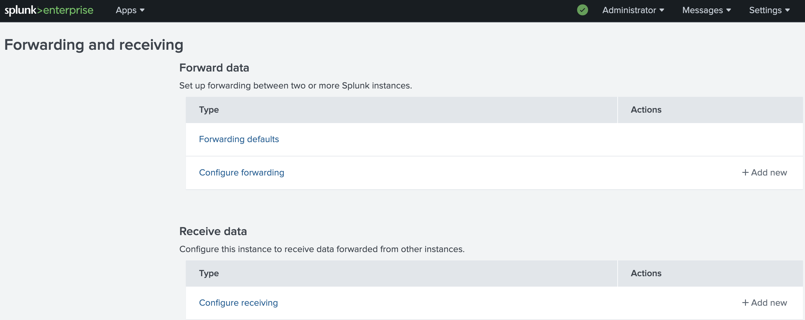
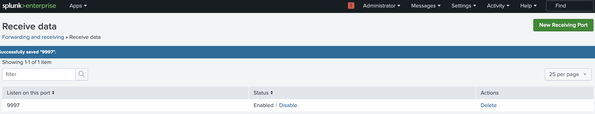

### Installing Universal Forwarder on Windows host, to ship logs to Splunk.

1. Download universal forwarder for Windows (You can have from Splunk website. It needs an account)

```bash
wget -O splunkforwarder-9.2.1-78803f08aabb-x64-release.msi "https://download.splunk.com/products/universalforwarder/releases/9.2.1/windows/splunkforwarder-9.2.1-78803f08aabb-x64-release.msi"
```

2. Install the Universal Forwarder. 
- The username the installer asks for is an in app username, not an OS level username.
- 
---

198.

3. Checks the runding Service
```ps
Get-Service SplunkForwarder
```


4. Test the connection between the client and the Splunk server (Repace the server IP)
- Note: Port 8089 is an API port. 9997 is a default TCP port for receiving, it needs to be configured first. Connections to port 9998 is TLS protected communication.
```ps
Test-NetConnection 192.168.33.14 -Port 8089
```

```ps
Test-NetConnection 192.168.33.14 -Port 9997
```

```ps
Test-NetConnection 192.168.33.14 -Port 443
```


5. Download universal forwarder for Linux

```
wget -O splunkforwarder-9.2.1-78803f08aabb-linux-2.6-amd64.deb "https://download.splunk.com/products/universalforwarder/releases/9.2.1/linux/splunkforwarder-9.2.1-78803f08aabb-linux-2.6-amd64.deb"
```

6. Install the downloaded image

```bash
$dpkg -i splunkforwarder-9.2.1-78803f08aabb-linux-2.6-amd64.deb

Selecting previously unselected package splunkforwarder.
(Reading database ... 300230 files and directories currently installed.)
Preparing to unpack splunkforwarder-9.2.1-78803f08aabb-linux-2.6-amd64.deb ...
Unpacking splunkforwarder (9.2.1+78803f08aabb) ...
Setting up splunkforwarder (9.2.1+78803f08aabb) ...
complete
```

7. Just to be sure about the ownership of the splunk directory
```bash
chown -R splunkfwd:splunkfwd $SPLUNK_HOME
```

8. Start the Forwarder
```bash
sudo /opt/splunkforwarder/bin/splunk start --accept-license
```

9. [optional] Upgrading the Forwarder
```bash
/opt/splunkforwarder/bin/splunk stop
dpkg --install new_package.deb
/opt/splunkforarder/bin/splunk start --accecp-license
```

10. Configure Splunk to receive data. Go to Settings --> Data --> Forwarding and receiving --> Configure receiving. Use default port 9997.
---



Note: You can tcpdump the packet comming from Win client to Splunk server to be sure it arrives.
```bash
tcpdump -i ens160 port 9997 -n
```
