### Installing Universal Forwarder on Windows host, to ship logs to Splunk.

Note: you can access the windows pc via RDP as well from your own PC/mac. It's easier to copy/paste content like commands to and from the host. For that configure a port forward rule on the firewall.
- Log-in to FMC (198.18.133.102) and
- Devices --> NAT --> Edit the existing rule --> Add Rule (right upper corner) --> and set it according:
- The win10-PC object should be: 198.18.2.10
---
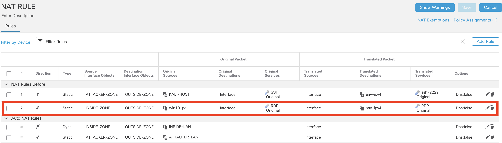

1. Download universal forwarder for Windows (You can download it from Splunk website. It needs an account)

```ps
wget -O splunkforwarder-9.2.1-78803f08aabb-x64-release.msi "https://download.splunk.com/products/universalforwarder/releases/9.2.1/windows/splunkforwarder-9.2.1-78803f08aabb-x64-release.msi"
```

2. Install the Universal Forwarder. 
- The username the installer asks for is an in app username, not an OS level username.
---
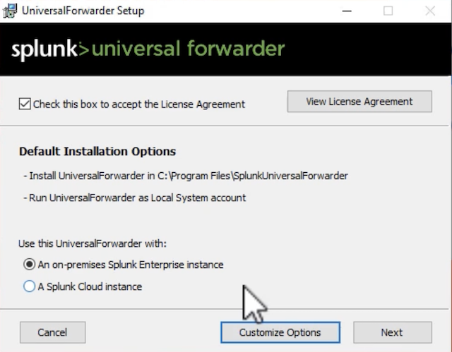

3. Check the running Service
```ps
Get-Service SplunkForwarder
```

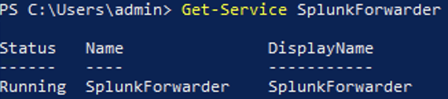


4. Test the connection between the client and the Splunk server (Replace the server IP)
- Note: Port 8089 is an API port. 9997 is a default TCP port for receiving, it needs to be configured first. Connections to port 9998 is TLS protected communication.
```ps
Test-NetConnection 192.168.33.14 -Port 8089
```

```ps
Test-NetConnection 192.168.33.14 -Port 9997
```

```ps
Test-NetConnection 192.168.33.14 -Port 443
```
---
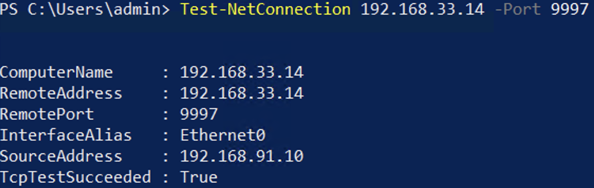

5. Configure Splunk to receive data. Go to Settings --> Data --> Forwarding and receiving --> Configure receiving. Use default port 9997.
---
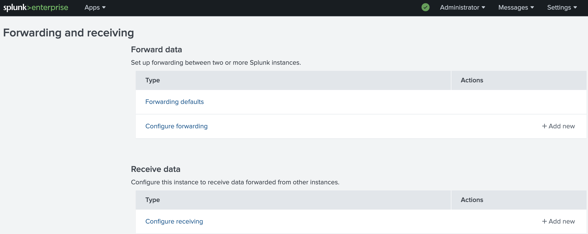
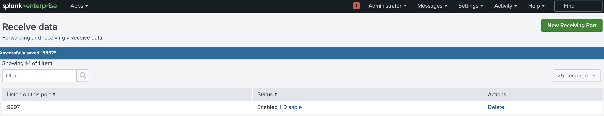

Note: You can tcpdump the packet coming from Win client to Splunk server to be sure it arrives.
```bash
tcpdump -i ens160 port 9997 -n
```

After enabling the listening port, the test connection to it, should be sucessful:
---
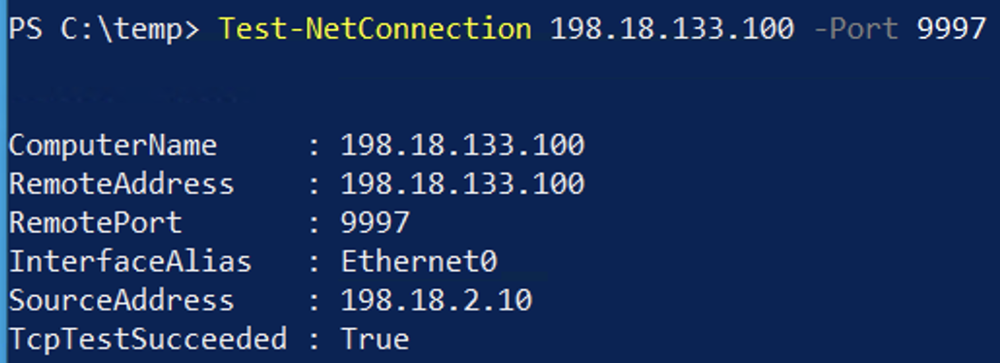

6. Download and install the Splunk Add-on for Windows from here (Login in required):
https://splunkbase.splunk.com/app/742
---
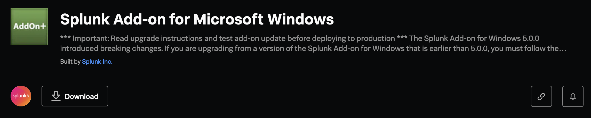

Note: The following table show where the Add-on can be installed:
---
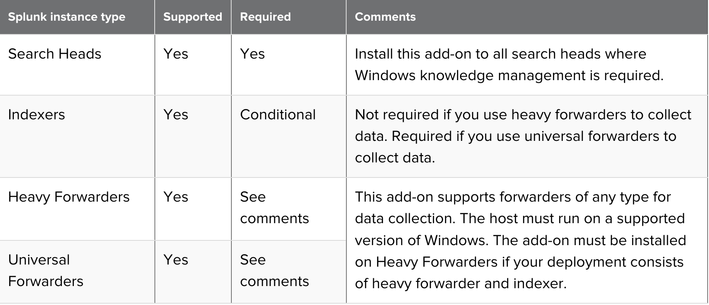

7. Extraxt the .tgz and the .tar file as well wih the downloadad 7zip (or similar program) until you see the folder structure (Splunk_TA_windows)
```ps
wget -O 7z2406-x64.exe "https://www.7-zip.org/a/7z2406-x64.exe
```
---
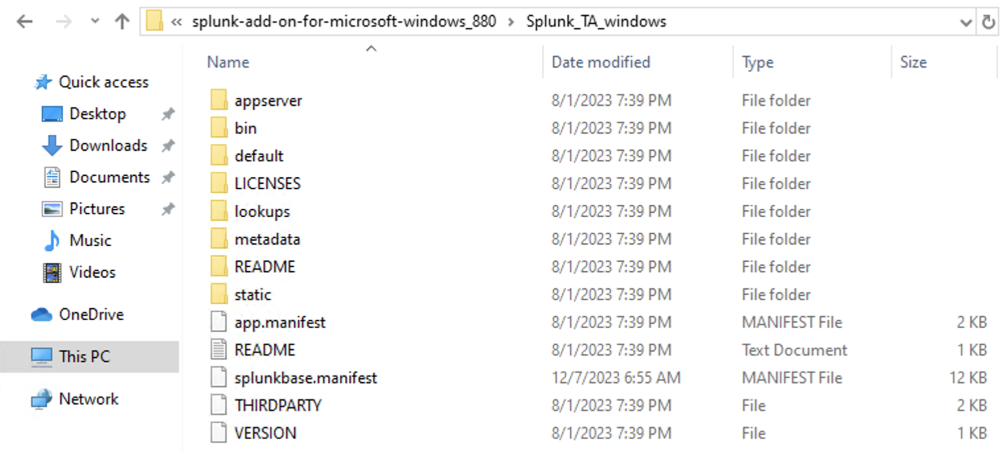

8. Copy the "Splunk_TA_windows" folder the to the Splunk install directory APP folder, which is: C:\Program Files\SplunkUniversalForwarder\etc\apps\
---
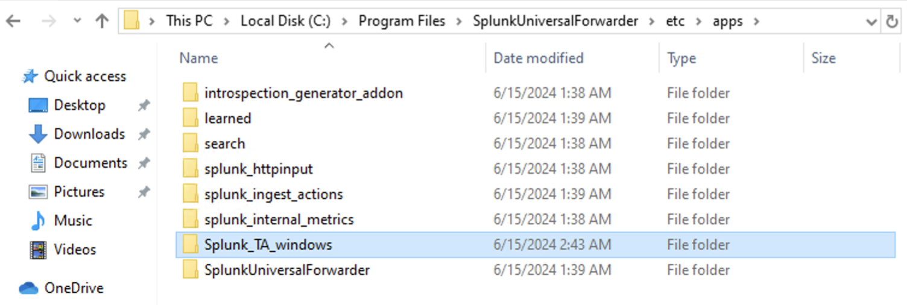

9. To make the APP active, we need to restart the Splunk. As it runs with system priviledges, we need an elavated cmd.
```ps
C:\Program Files\SplunkUniversalForwarder\bin>splunk restart
```
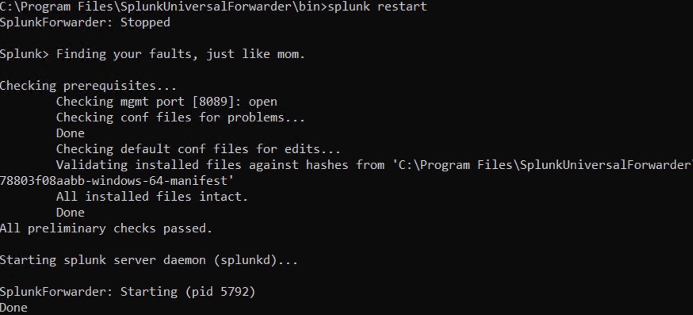

10. Lets create an input.conf file which describes what logs we want to ship from Windows to Splunk.
- Create a folder in C:\Program Files\SplunkUniversalForwarder\etc\apps\Splunk_TA_windows and name it "local"
- Create an inputs.conf text file in the C:\Program Files\SplunkUniversalForwarder\etc\apps\Splunk_TA_windows folder.
Note1: start notepad.exe in admin mode (Run as Administrator) and save the file in the folder.
Note2: make sure the local.conf file does not have .txt extension!


11. With the "inputs.conf" file we can start shipping security event logs (as others as well) to Splunk.
Note: The first line tells to the forwarder what logs to ship and the second to enable it (no disable ;)

```ps
[WinEventLog://Security]
disable=0
```

12. Verify the outputs.conf file to have the proper IP address and port configured. It's located in c:\Program Files\SplunkUniversalForwarder\etc\system\local. You should see something similar. A default group with a name is defined and a Splunk server is assigned to it.

```ps
[tcpout]
defaultGroup = default-autolb-group

[tcpout:default-autolb-group]
server = 198.18.133.100:9997
```

13. Restart once more the UniversalForwarder
```ps
cd 'C:\Program Files\SplunkUniversalForwarder\bin'
./splunk restart
```

Note: Make changes in the "local" folder. We are note changing anything in the default folder except if we are the author of the App!

14. And lastly configure the Windows Add-on to the Splunk server itself.
- Login to Splunk via web
- Go to Apps --> Find more Apps -- Search for "Splunk Add-on for Microsoft Windows" and install it. (Installing from a file would work as well)
---
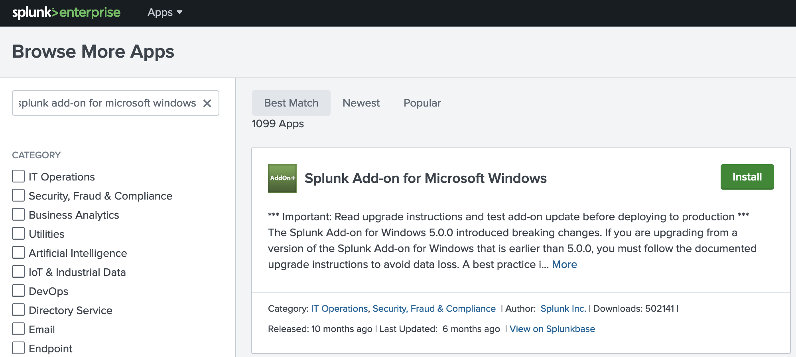

Otional: Check the /opt/splunk/etc/app/Splunk_TA_windows/default/inputs.conf file. It contains many stanzas, ready to be used if you want to onboard applications. 

```ps
###### OS Logs ######
[WinEventLog://Application]
disabled = 1
start_from = oldest
current_only = 0
checkpointInterval = 5
renderXml=true

[WinEventLog://Security]
disabled = 1
start_from = oldest
current_only = 0
evt_resolve_ad_obj = 1
checkpointInterval = 5
blacklist1 = EventCode="4662" Message="Object Type:(?!\s*groupPolicyContainer)"
blacklist2 = EventCode="566" Message="Object Type:(?!\s*groupPolicyContainer)"
renderXml=true

[WinEventLog://System]
disabled = 1
start_from = oldest
current_only = 0
checkpointInterval = 5
renderXml=true
```

