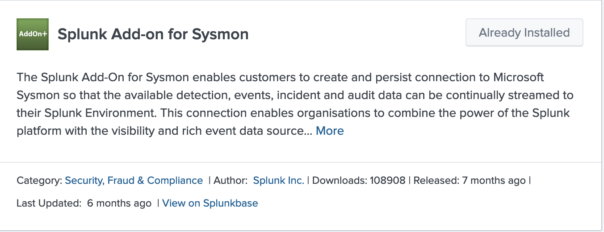
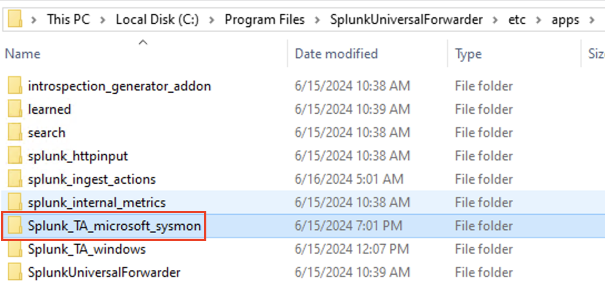
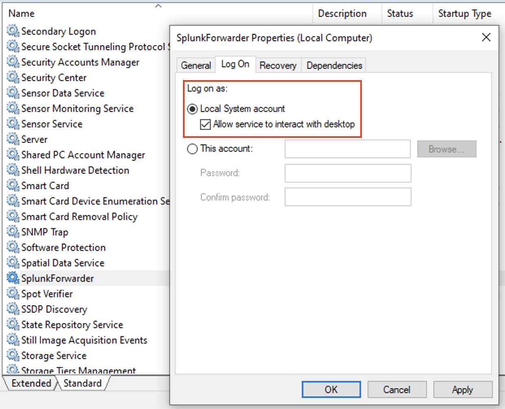
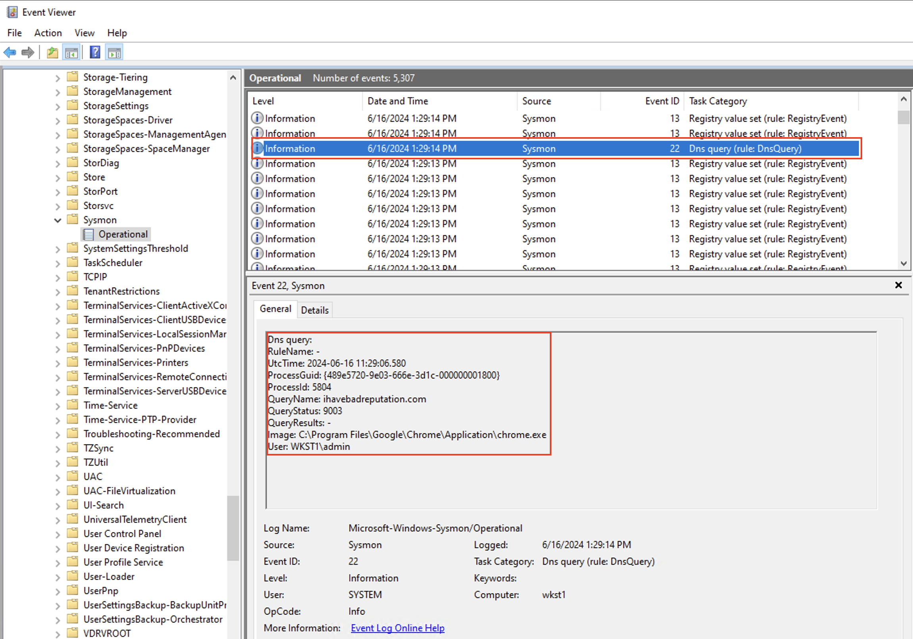
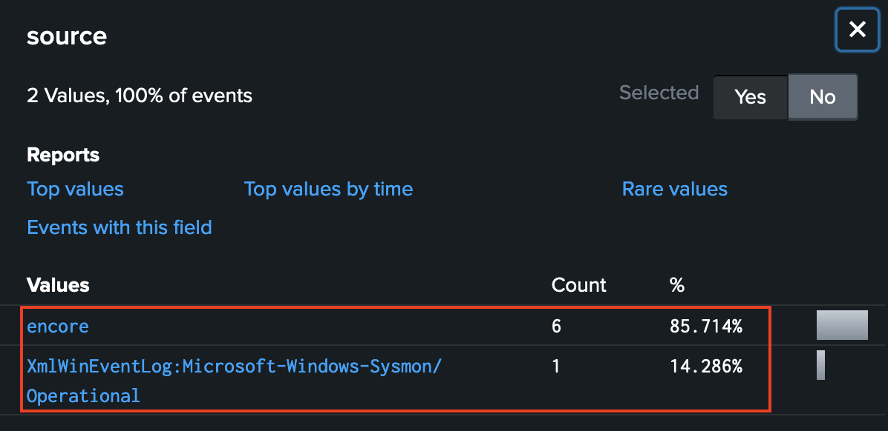
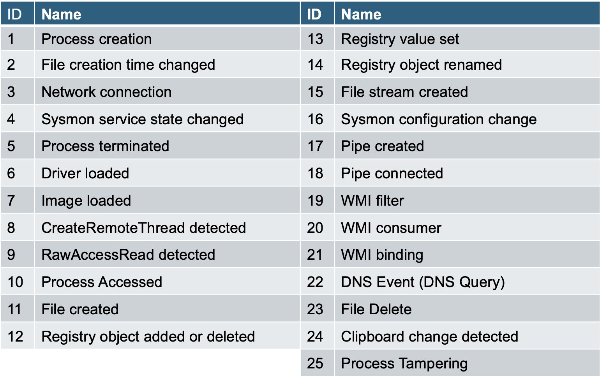

###Sysmon 

Windows logs were never designed for security and there is no Windows event log number 666, i am evil. Reconstructing an event with the base windows event is thought. Luckily, we can use Sysmon which is Windows system service and logs system activity. It provides a detailed information about process creation, network connections, and changes to file creation time. More information> https://learn.microsoft.com/en-us/sysinternals/downloads/sysmon

1. Login to windows client machine, download Sysmon and extract it to the c:\temp folder.
```ps
Invoke-WebRequest https://download.sysinternals.com/files/Sysmon.zip -OutFile c:\temp\Sysmon.zip
```

2. Download the Sysmon configuration file. The default config is good as well but using SwiftOnSecurity's (https://github.com/SwiftOnSecurity/sysmon-config) or Olaf Hartong's modular Sysmon config will have a much better outcome.
```ps
Invoke-WebRequest https://raw.githubusercontent.com/olafhartong/sysmon-modular/master/sysmonconfig-with-filedelete.xml -OutFile c:\temp\sysmonconfig-with-filedelete.xml
```

3. Install Sysmon with “specific configuration, xml file”
```ps
C:\Temp\Sysmon\Sysmon64.exe -accepteula -i C:\temp\sysmonconfig-with-filedelete.xml
```

4. Dump Sysmon configuration file: (it's gonna be a long list :)
```ps
C:\Temp\Sysmon\Sysmon\Sysmon.exe -c
```

5. Let's check if the service is running:
```ps
Get-Service Sysmon64
```
---


6. Check the Sysmon log events in the Windows Event viewer.
- Type "eventvwr" in the windows run command dialog box (or from the Administration Tools)
- Find the "Sysmon" entry in the "Applications and Services log --> Microsoft --> Windows --> Sysmon"

---


6. We need one more Splunk APP on the Windows machine and on the Splunk server as well, to ship sysmon generated logs.
- Install "Splunk Add-on for Sysmon", Login to Splunk web and go to Apps --> Find More Apps --> search for the app and install it.
---


- Download the same Add-on to the windows 10 machine. 
- Use 7-zip (or something similar) to extract the .gz and the .tar. (splunk-add-on-for-sysmon_400.tgz)
- Copy the folder content of "Splunk_TA_microsoft_sysmon" into C:\Program Files\SplunkUniversalForwarder\etc\apps\

---


7. Verify the "input.conf" file, it's preconfigured and doesn't need to be changed. 

```ps
...
[WinEventLog://Microsoft-Windows-Sysmon/Operational]
disabled = false
renderXml = 1
source = XmlWinEventLog:Microsoft-Windows-Sysmon/Operational
...
```

8. Finally, change the "SplunkForwarder" service's priviled on the win10 machine to run under Local system account. 
---


9. You should see Sysmon log events in the Splunk. Open a browser on the client machine and go to the site: "ihavebadreputation.com".
- Check the sysmon log in the EventViewer, you can search for a string at the right pannel:
---

- Note: you can see the DNS query made by the client to the domain. 
<br>

- the result can be found in the Splunk too. Search for the domain in the App --> Serach and Reports. Sysmon and the Firewall integration (eNcore) reports the DNS query as well.
---

- Note: you can search for Sysmon EventCode=22 in Splunk. EventCode 22 is the DNS query logging in the Sysmon. Take a look at the details: https://learn.microsoft.com/en-us/sysinternals/downloads/sysmon
--0
