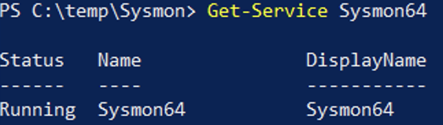
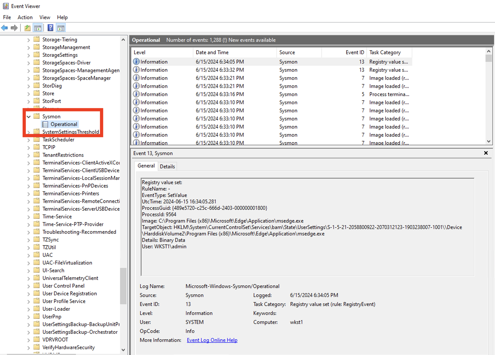

###Sysmon 

Windows logs were never designed for security and there is no Windows event log number 666, i am evil. Reconstructing an event with the base windows event is thought. Luckily, we can use Sysmon which is Windows system service and logs system activity. It provides a detailed information about process creation, network connections, and changes to file creation time. More information> https://learn.microsoft.com/en-us/sysinternals/downloads/sysmon

1. Login to windows client machine, download Sysmon and extract it to the c:\temp folder.
```ps
Invoke-WebRequest https://download.sysinternals.com/files/Sysmon.zip -OutFile c:\temp\Sysmon.zip
```

2. Download the Sysmon configuration file. The default config is good as well, but using SwiftOnSecurity's (https://github.com/SwiftOnSecurity/sysmon-config) or Olaf Hartong's modular Sysmon config will have a much better outcome.
```ps
Invoke-WebRequest https://raw.githubusercontent.com/olafhartong/sysmon-modular/master/sysmonconfig-with-filedelete.xml -OutFile c:\temp\sysmonconfig-with-filedelete.xml
```

3. Install Sysmon with “specific configuration, xml file”
```ps
C:\Temp\Sysmon\Sysmon64.exe -accepteula -i C:\temp\sysmonconfig-with-filedelete.xml
```

4. Dump Sysmon configuration file:
```ps
C:\Temp\Sysmon\Sysmon\Sysmon.exe -c
```

5. Lets check if the service is running:
```ps
Get-Service Sysmon64
```


6. Check the Sysmon log events in the Windowd Event viewer.
- Type "eventvwr" in the windows run command dialog box (or from the Administration Tools)
- Find the "Sysmon" entry in the "Applications and Services log --> Microsoft --> Windows --> Sysmon"




6. Configure Splunk universal forwarder to pick-up Sysmon created files and sent it over for indexing.