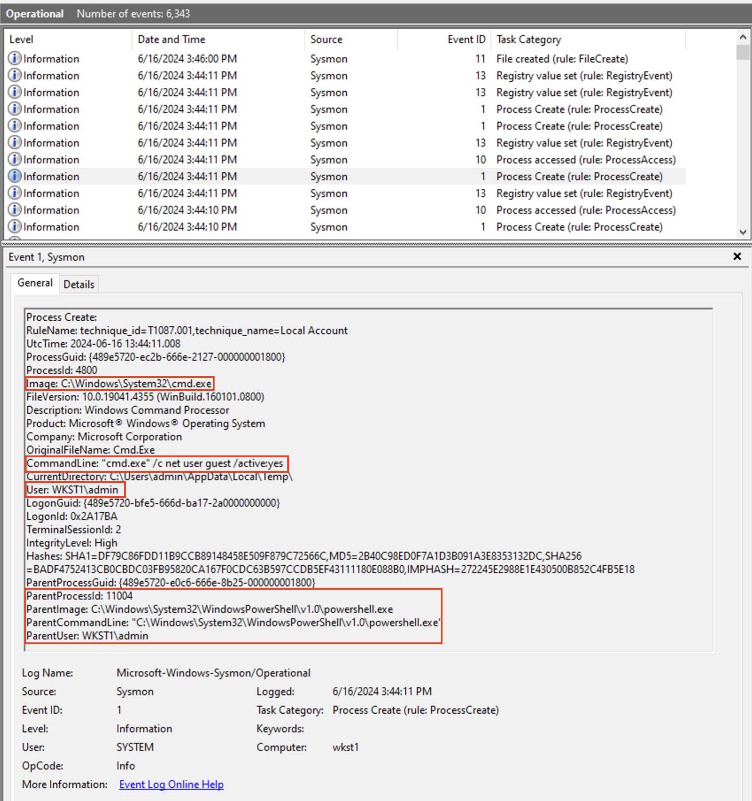

### Adversaries may obtain and abuse credentials of a default account as a means of gaining Initial Access, Persistence, Privilege Escalation, or Defense Evasion. Default accounts are those that are built-into an OS, such as the Guest or Administrator accounts on Windows systems

After execution the DEfault Guest account will be anabled (Active) and added to Administrators and Remote Desktop Users Group, and desktop will allow multiple RDP connections


1. Open a powershell prompt and get basic info about the tests. Use “–ShowDetails” switch for more details. You can see the all the commands the script executes.
```ps
PS C:\AtomicRedTeam> Invoke-AtomicTest T1078.001 –ShowDetailsBrief

PathToAtomicsFolder = C:\AtomicRedTeam\atomics
T1078.001-1 Enable Guest account with RDP capability and admin privileges T1078.001-2 Activate Guest Account
```

2. Run the first test
```ps
PS C:\AtomicRedTeam> Invoke-AtomicTest T1078.001 -TestNumbers 1

Executing test: T1078.001-1 Enable Guest account with RDP capability and admin privileges
The command completed successfully.
The operation completed successfully.
Done executing test: T1078.001-1 Enable Guest account with RDP capability and admin privileges
```

3. Run the second
```ps
PS C:\AtomicRedTeam> Invoke-AtomicTest T1078.001 -TestNumbers 2

Executing test: T1078.001-2 Activate Guest Account
The command completed successfully.
Done executing test: T1078.001-2 Activate Guest AccouBRnKSEtC-2
```

---

<br>


- Note: Sysmon events are generated, Guest user is activated and added to the Remote Desktop and admin group. Hm?

4. Look for an event in the Splunk. Apps --> Search & Report --> "net user guest"