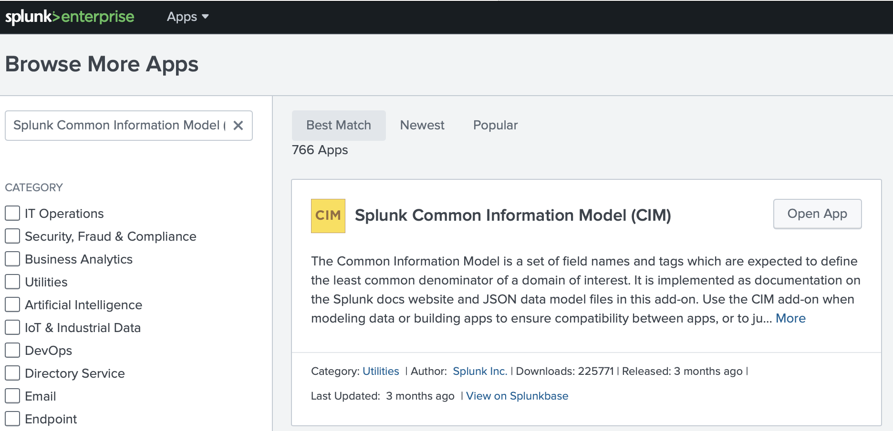
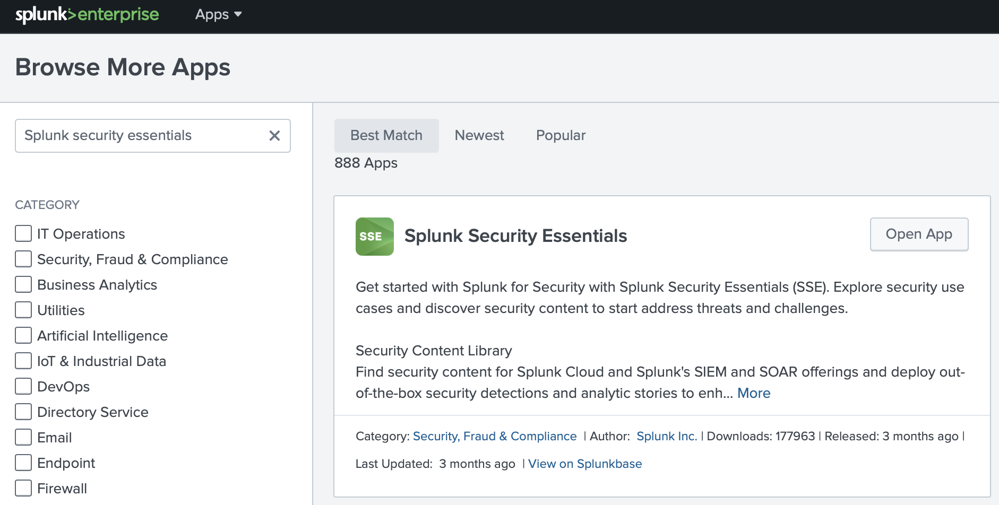

### Splunk Security Essentials
1. Let's get familiar with **Splunk Security Essentials**. Explore security use cases and discover security content to start address threats and challenges.

But before you go, make sure you have **Splunk Common Information Model (CIM)** app installed. 
 
Apps > Find More Apps 

2. Install **Splunk Security Essentials**
 
Apps > Find More Apps 

