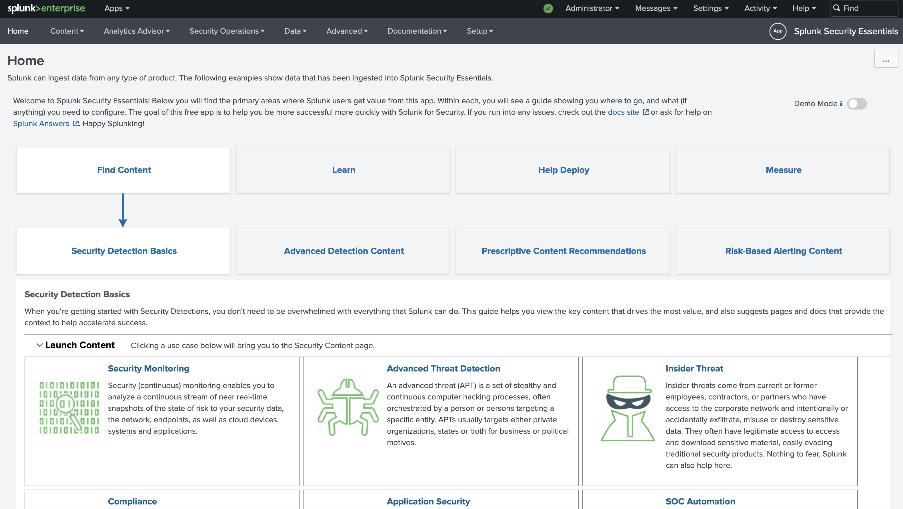
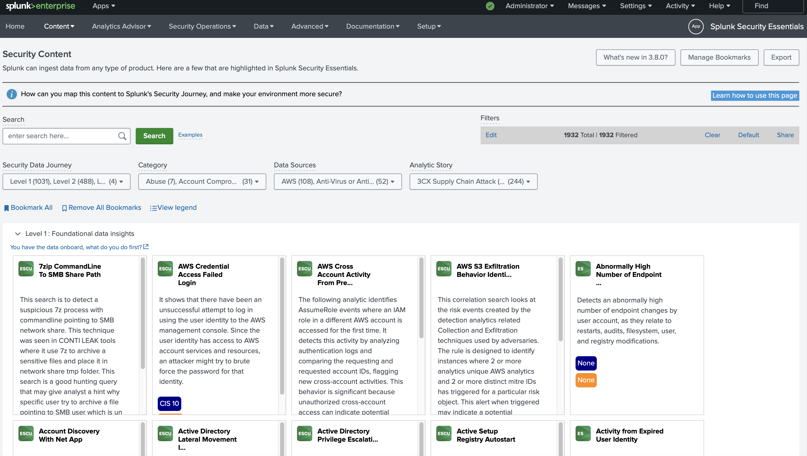
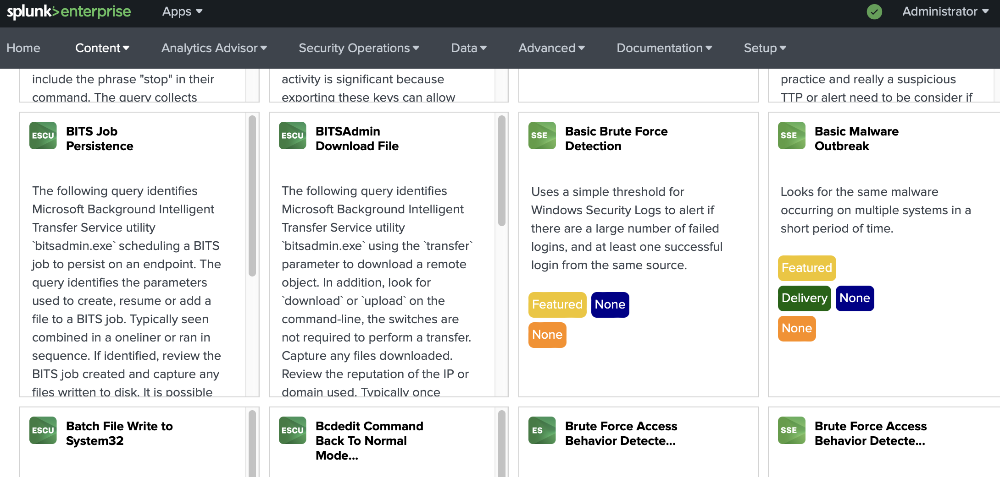

### Splunk Security Essentials
1. Let's get familiar with **Splunk Security Essentials**. Explore security use cases and discover security content to start address threats and challenges.
But before you go, make sure you have **Splunk Common Information Model (CIM)** app installed. 

Apps > Find More Apps 

---
2. Install Splunk Security Essentials

Apps > Find More Apps

3. Open Splunk Security Essentials
Click on Find Content > Security Detection Basics > Security Monitoring

Find BITSAdmin Download File 

