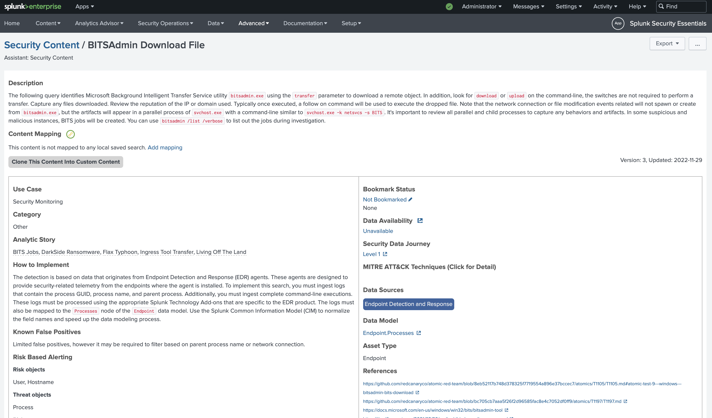

### Splunk Security Essentials
1. Let's get familiar with **Splunk Security Essentials**. Explore security use cases and discover security content to start address threats and challenges.
But before you go, make sure you have **Splunk Common Information Model (CIM)** app installed. 

Apps > Find More Apps 

---
2. Install Splunk Security Essentials

Apps > Find More Apps

3. Open Splunk Security Essentials
Click on Find Content > Security Detection Basics > Security Monitoring

  

4. Find **BITSAdmin Download File** and open it

Here you get a description about the query which identifies Microsoft Background Intelligent Transfer Service utility bitsadmin.exe using the transfer parameter to download a remote object (for example a malware stager, or other payload).  

  

 
And you can check the query (or modify - not recommended at first time) and run it to get some interesting result.

  

5. Lets go to the Kali, and prepare the attacker host. We need a webserver to host our malware/  
