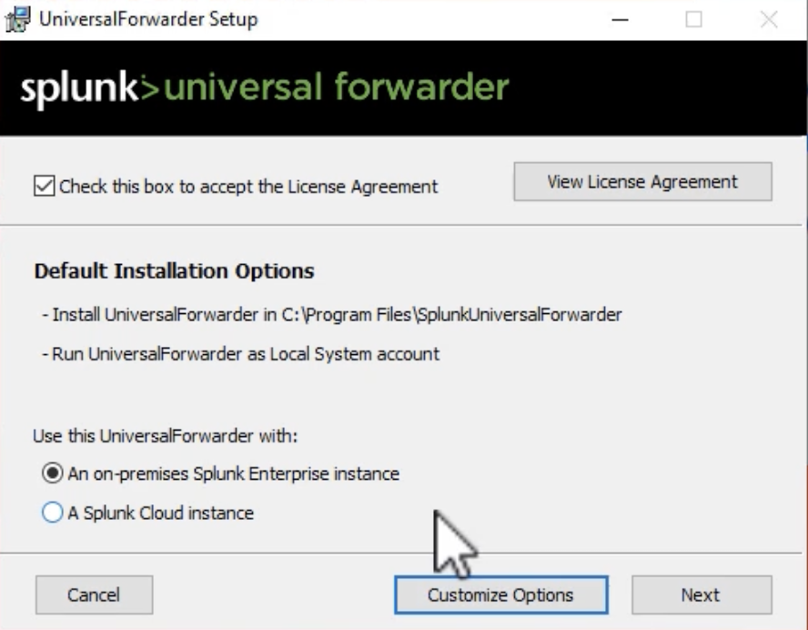
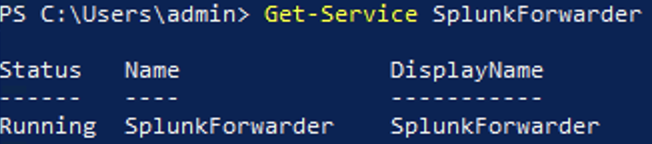
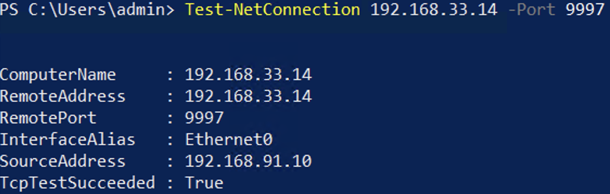

1. Download universal forwarder for Win

```bash
wget -O splunkforwarder-9.2.1-78803f08aabb-x64-release.msi "https://download.splunk.com/products/universalforwarder/releases/9.2.1/windows/splunkforwarder-9.2.1-78803f08aabb-x64-release.msi"
```

2. Install it



3. Checks the runding Service)
```ps
Get-Service SplunkForwarder
```




4. Test the connection between the client and the Splunk server
```ps
Test-NetConnection 192.168.33.14 -Port 8089
```

```ps
Test-NetConnection 192.168.33.14 -Port 9997
```

```ps
Test-NetConnection 192.168.33.14 -Port 8000
```



5. Download universal forwarder for Linux

```
wget -O splunkforwarder-9.2.1-78803f08aabb-linux-2.6-amd64.deb "https://download.splunk.com/products/universalforwarder/releases/9.2.1/linux/splunkforwarder-9.2.1-78803f08aabb-linux-2.6-amd64.deb"
```

6. dpkg -i splunkforwarder-9.2.1-78803f08aabb-linux-2.6-amd64.deb