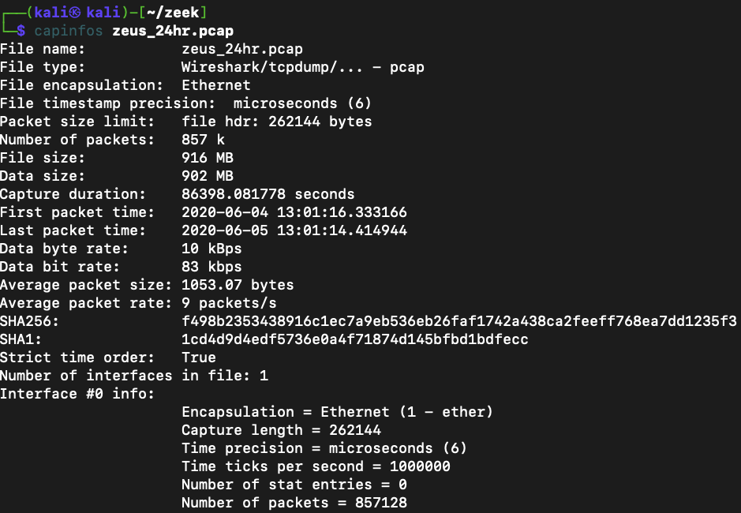
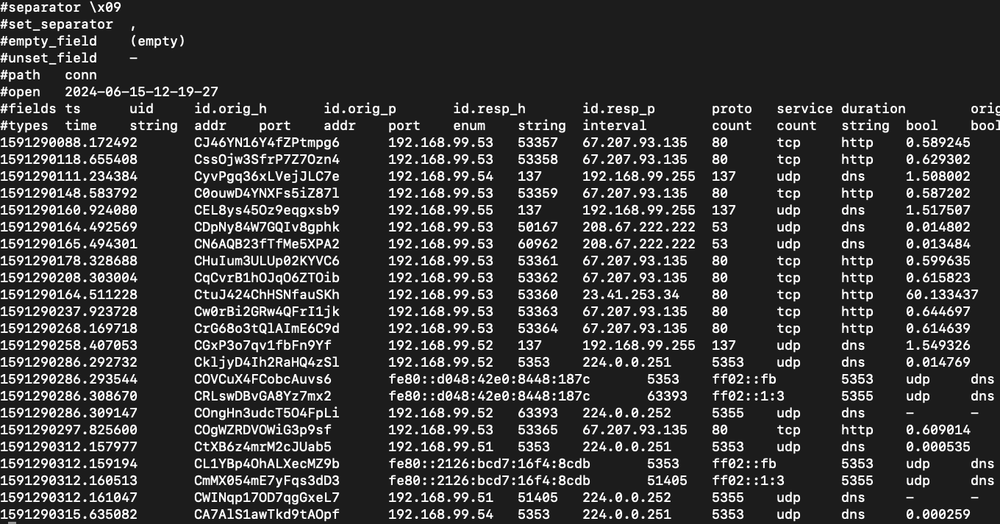

### Zeek is an open-source network analysis tool. The engine analysis live or recorded network traffic and interprets what it sees and create compact, high-fidelity transaction logs, file content and fully customizable output.
more information: https://zeek.org/


- Note: Befor you install Zeek, a base OS upgrade is recommended. It might take ~20-30m

```bash
apt-get update -y && apt-get upgrade -y
```

1. We are going to use Zeek to find beacons in the pre-recorded network traffic, in PCAP files.
- Login to Kali and install Zeek
```bash
echo 'deb http://download.opensuse.org/repositories/security:/zeek/Debian_12/ /' | sudo tee /etc/apt/sources.list.d/security:zeek.list
curl -fsSL https://download.opensuse.org/repositories/security:zeek/Debian_12/Release.key | gpg --dearmor | sudo tee /etc/apt/trusted.gpg.d/security_zeek.gpg > /dev/null
sudo apt install zeek
```


2. Add Zeek to the PATH
```bash
export PATH="/opt/zeek/bin:$PATH"
```

3. check the Zeek version:
```bash
$ zeek -v
zeek version 6.2.1
```

4. Zeek creates many file types from the PCAP. Like, conn, dns, files, http, ssl etc.
<br>
First download a PCAP which is 24h capture and includes Zeus botnet traffic as well.

```bash
mkdir zeek
cd zeek
``` 
```bash
wget https://www.dropbox.com/s/s2fs42a30z5xp36/zeus_24hr.pcap
```

5. Check the file structure and infos with capinfos
```bash
capinfos zeus_24hr.pcap
```


6. Create Zeek files from the PCAP.
```bash
zeek -C -r zeus_24hr.pcap "tcp_inactivity_timeout = 60 min;"

$ ls                            
conn.log  dns.log    http.log  ocsp.log           ssl.log   zeus_24hr.pcap
dhcp.log  files.log  ntp.log   packet_filter.log  x509.log
```

7. List the content of conn.log. Use flag -S for screen width to the chopped
```bash
less -S conn.log
```
---


8. List the the top 10 most active destination
- id.resp_h --> destination IP
- id.resp_p --> destination port
- service --> detected service type by Zeek engine
- sort --> it's a linux tool, sorts the output in order
- uniq -c --> print only once the same lines and -c tells to it to count the same numbers
- sort -rn --> sort the output in a revers order
- head --> list the top 10 only

```bash
cat conn.log | zeek-cut id.resp_h id.resp_p service | sort | uniq -c | sort -rn | head
```

9. Lets find out the source machine
```bash
cat conn.log | zeek-cut id.orig_h id.resp_h id.resp_p | grep 67.207.93.135 | sort | uniq -c

2882 192.168.99.53	67.207.93.135	80
```

10. Examine the distribution of suspicious beacons over a 24-hour period
- create a small script (credit goes to Chris Benton)

```bash
echo "cat conn.* | zeek-cut -d ts id.orig_h id.resp_h | grep \$1 | grep \$2 | sed 's/T/:/g' | cut -d ':' -f 2 | sort | uniq -c | tr -s \" \" | awk '{ print \$2 \" \" \$1}' " > beacon_frequency
```

11. Add +x (execute) to the file, so you can run it
```bash
chmod +x beacon_frequency
```

12. Run the script with the suspicious internal IP and the public IP that was contacted almost 3000 times within a 24-hour period. 
<br>
- Note: From the output, you can see it's a clear case of beaconing. The first column represents hours (0-24), and the second column shows the number of times the malware phoned home. The pattern is very consistent, with little to no jitter. It's time to initiate the incident response process.

```bash
$ ./beacon_frequency 192.168.99.53 67.207.93.135

00 120
01 121
02 120
03 121
04 120
05 121
06 121
07 120
08 121
09 120
10 121
11 120
12 120
13 121
14 119
15 118
16 118
17 118
18 120
19 121
20 120
21 121
22 120
23 120
```

13. To continue the hunt, let's check the http.log file to gather more details. The requested URI could provide valuable insights.
```bash
$ cat http.log| zeek-cut id.orig_h id.resp_h id.resp_p  hsot uri | sort | uniq -c | sort -rn | grep 67.207.93.135

2882 192.168.99.53	67.207.93.135	80		/metro91/admin/1/ppptp.jpg
```

```bash
$ grep 67.207.93.135 http.log | head -1

1591290088.215764	CJ46YN16Y4fZPtmpg6	192.168.99.53	53357	67.207.93.135	80	1	GET	mahamaya1ifesciences.com	/metro91/admin/1/ppptp.jpg	-	1.1	Mozilla/4.0 (compatible; MSIE 7.0; Windows NT 5.1; SV1)	-	0	226132	200	OK	-	-	(empty)	-FShOFB3rVJEzLNHjqk	-	text/plain
```

Note: The host and URI is interesting. Like:
- Letter "1" instead of "l"
- User-Agent: Mozilla;WinNT
- It is noteworthy that the MIME type is "text/plain," but the requested URL ends with .jpeg. Shouldn't the MIME type be image/jpeg? Hm?

14. To further investigate, let's examine the User-Agent strings in the various web requests found in the http.log file:

```bash
cat http.log | zeek-cut id.orig_h id.resp_h user_agent | sort | uniq | cut -f 1,3 | sort | uniq -c
```
- Note: Interestingly, the endpoint 192.168.99.53 identifies itself as Windows 7 in some requests and as Windows 10 in others. Hm?

15. Alternatively you can use "ngrep" to get the same outout
```bash
ngrep -q -I zeus_24hr.pcap host 192.168.99.53 and 67.207.93.135 | head -7
T 192.168.99.53:53357 -> 67.207.93.135:80 [AP] #4
GET /metro91/admin/1/ppptp.jpg HTTP/1.1..Accept: */*..Host: mahamaya1ifesciences.com..Cache-Control: no-cache..Cookie: ubaLUA5A46IDcf2i7IHnEbRUmWwtp0Op90/YxBRUDC/oPnNS9mxCUX5XiJm7A2Tn4QuEA6D5Bog5EdRtRXl0vjst19b0gdDiMzvo74tbs+FNVQmVeULxeQMp2P4u2hpqT89pODNKsaQ1O4gozn8p0I7hTJwEdTrTptpvsY+kIdk=..User-Agent
```

- Note: you can check the reputation of the domain in the web request. 

16. Use tshark (CLI version of wireshark) to list the TCP streams from the PCAP
```bash
$ tshark -r zeus_24hr.pcap -T fields -e tcp.stream -e ip.src -e ip.dst -e tcp.dstport | sort -u -n
1	192.168.99.53	67.207.93.135	80
2	192.168.99.53	52.179.224.121	443
3	192.168.99.53	67.207.93.135	80
4	192.168.99.53	67.207.93.135	80
5	192.168.99.53	23.41.253.34	80
6	192.168.99.53	67.207.93.135	80
7	192.168.99.53	67.207.93.135	80
8	192.168.99.53	67.207.93.135	80
9	192.168.99.53	67.207.93.135	80
```

17. Follow the TCP stream. Check the details of the first stream
```bash
$ tshark -r zeus_24hr.pcap -q -z follow,tcp,ascii,1
===================================================================
Follow: tcp,ascii
Filter: tcp.stream eq 1
Node 0: 192.168.99.53:53357
Node 1: 67.207.93.135:80
383
GET /metro91/admin/1/ppptp.jpg HTTP/1.1
Accept: */*
Host: mahamaya1ifesciences.com
Cache-Control: no-cache
Cookie: ubaLUA5A46IDcf2i7IHnEbRUmWwtp0Op90/YxBRUDC/oPnNS9mxCUX5XiJm7A2Tn4QuEA6D5Bog5EdRtRXl0vjst19b0gdDiMzvo74tbs+FNVQmVeULxeQMp2P4u2hpqT89pODNKsaQ1O4gozn8p0I7hTJwEdTrTptpvsY+kIdk=
User-Agent: Mozilla/4.0 (compatible; MSIE 7.0; Windows NT 5.1; SV1)
Connection: Close
	105
HTTP/1.1 200 OK
Date: Thu, 4 Jun 2020 17:01:31 GMT
Content-Type: text/plain
Content-Length: 226132


$s=New-Object IO.MemoryStream(,[Convert]::FromBase64String("H4sIAAAAAAAA..................7+T8Acav9xZNWBQA="));IEX(New-Object IO.StreamReader(New-Object IO.Compression.GzipStream($s,[IO.Compression.CompressionMode]::Decompress))).ReadToEnd();

```

- Note: The dotted part of the outout is truncated. What we can find out from the output: <br>
17a - Create a new memory Stream Object (IO.MemoryStream) <br>
17b - The Base64 string (“…“) is converted into a byte array. Typically encoded and compressed code <br>
17c - Wraps the memory stream in a GZIP decompression stream. (Decompress) <br>
17d - A stream reader is created to read from the decompression stream (IO.StreamReader(…): <br>
17e - `IEX(…)`, alias for Invoke-Expression in PS, which executes a string as PS command. 

18. **It's time to start the Incident Response!**