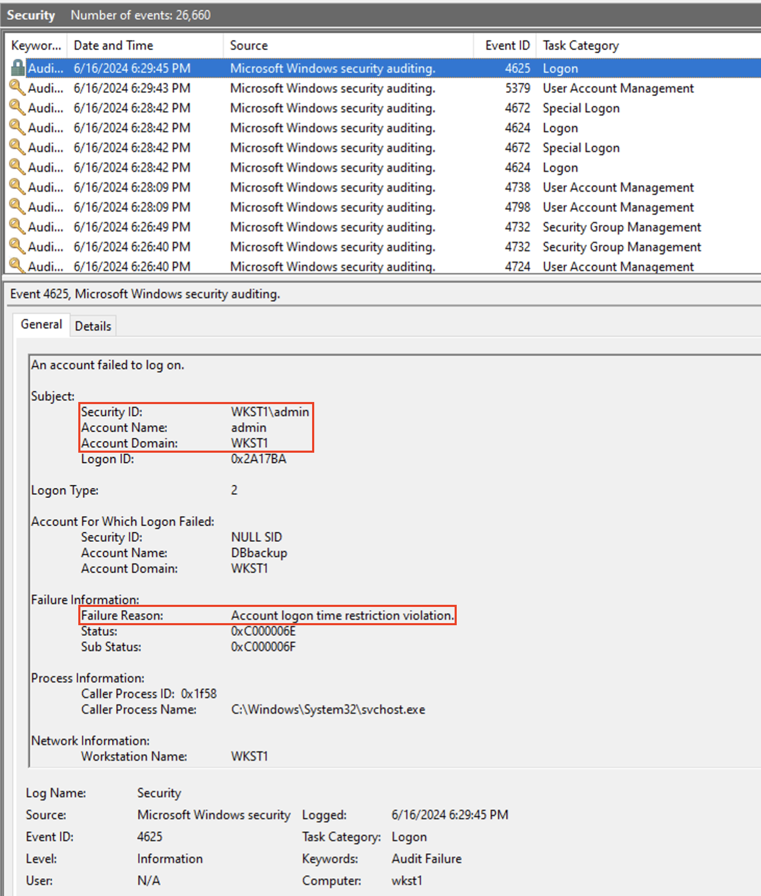
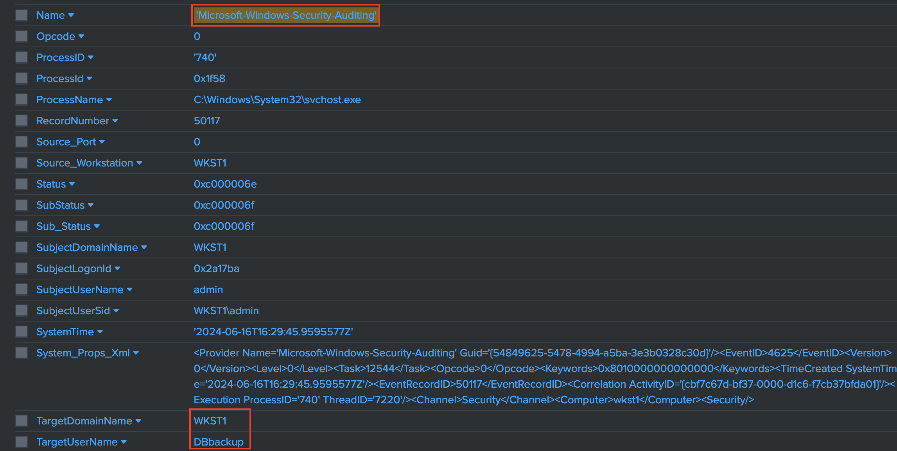

### A honeyaccount is a type of cybersecurity deception technique used to detect and monitor unauthorized access and malicious activity within an organization. Similar to honeypots, which are decoy systems set up to lure attackers, honeyaccounts are decoy user accounts that are intentionally created and left with minimal protection to attract potential attackers.

1. Log in to the Windows 10 machine and create a user with administrative privileges. The password can be exceptionally long since it will never be used; it is intended as a decoy.

```cmd
net user /add DBbackup password1
net localgroup administrators DBbackup /add
```

2. Disable the logon hours for the user created in the previous step. This will prevent the account from logging in at any time, though the account itself remains active.

```cmd
net user DBbackup /times:
```

3. Make a DBbackup user authentication with runas
```cmd
runas /user:DBbackup cmd.exe

RUNAS ERROR: Unable to run - cmd.exe
1327: Account restrictions are preventing this user from signing in. For example: blank passwords aren't allowed, sign-in times are limited, or a policy restriction has been enforced.
```

4. This login attempt should trigger an alarm, indicating a potential compromise. Adversaries are unaware that the account has no legitimate use and is actually a decoy, as in this scenario.
---

<br>

